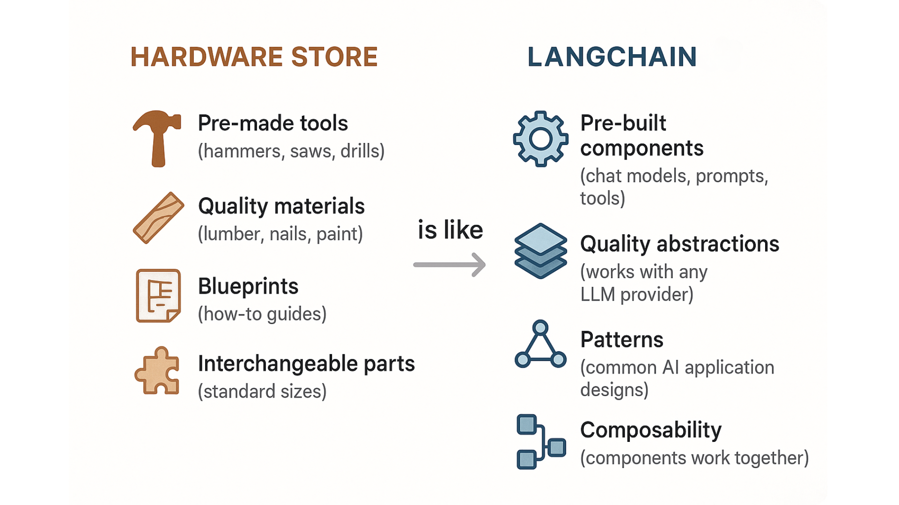
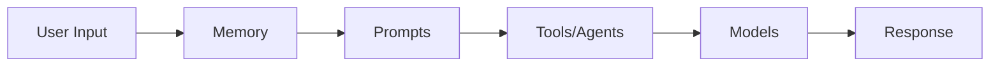
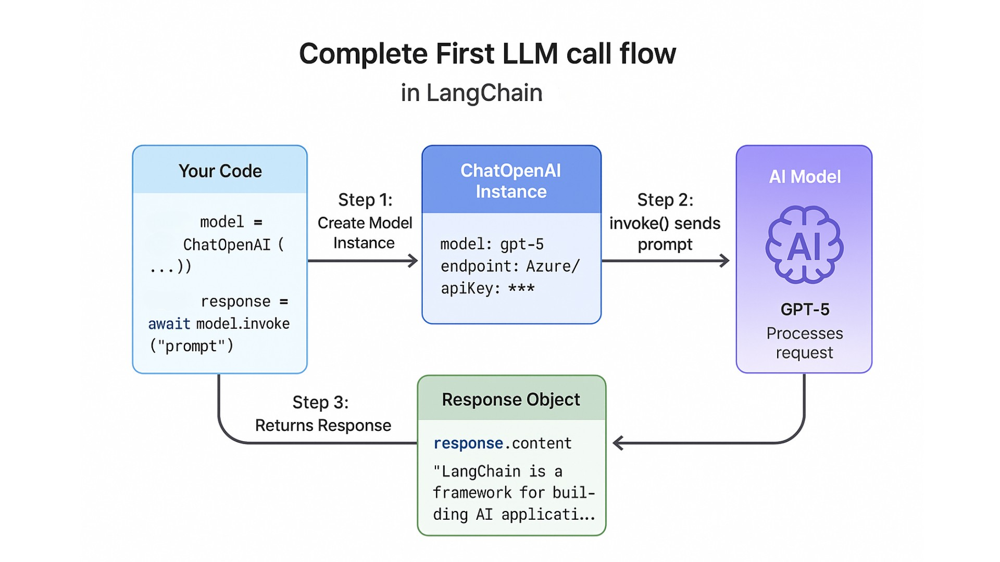
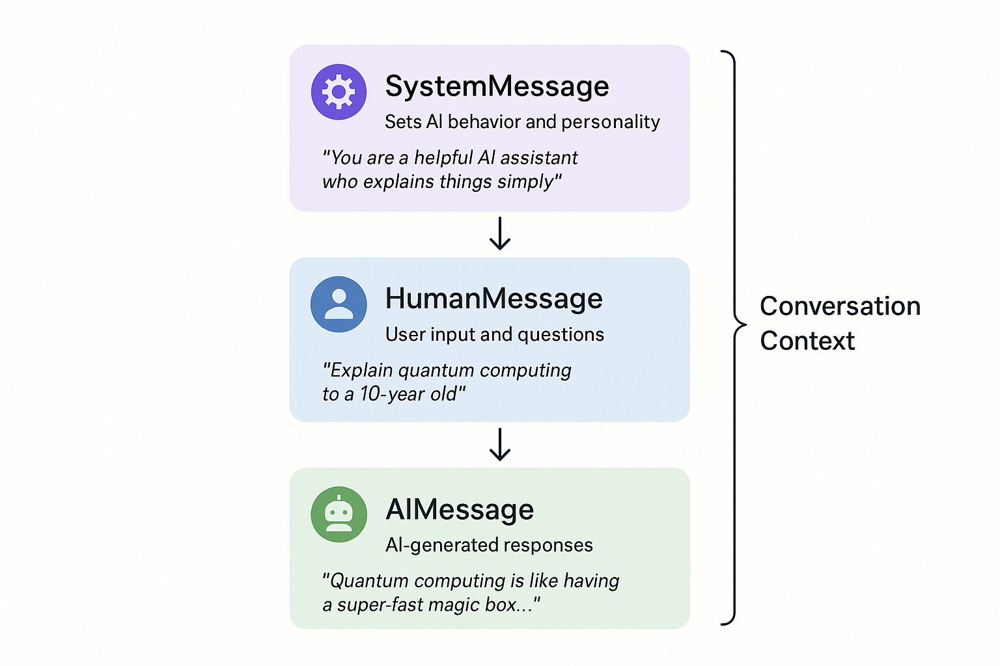
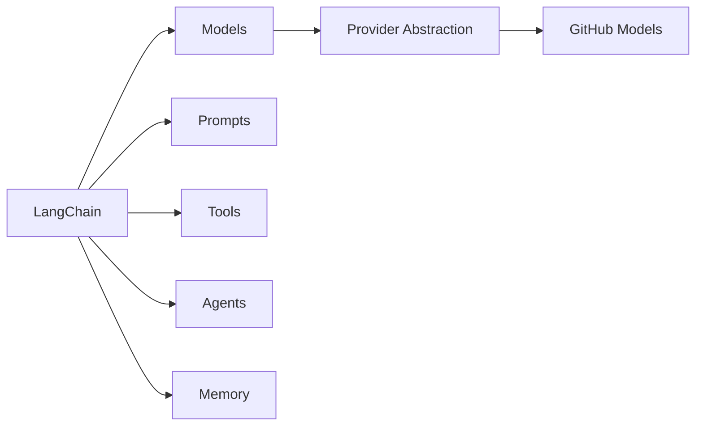

# Introduction to LangChain

In this lab, you'll learn what LangChain is, why it exists, explore its core concepts like models, prompts, and tools, and make your first LLM call using GitHub Models. By the end, you'll understand how LangChain provides a consistent interface across different AI providers, making it easy to switch between them with just environment variables.

## Course Setup

### Step 1: Install Python

You'll need **Python 3.10 or higher** to run LangChain v1 applications.

#### Check if Python is installed

```bash
python --version
# or
python3 --version
```

If you see Python 3.10 or higher, you're good! Skip to [Step 2](#step-2-clone-the-repository). If not:

#### Install Python

1. Visit [python.org](https://www.python.org/downloads/)
2. Download Python 3.10+ for your operating system
3. Follow the installation instructions (make sure to check "Add Python to PATH" on Windows)
4. Verify installation:

```bash
python --version  # Should show 3.10 or higher
pip --version     # Should show pip version
```

---

### Step 2: Clone the Repository

```bash
# Clone the course repository
git clone https://github.com/massimotisi/llm-engineering-course

# Navigate to the project
cd llm-engineering-course

# Create a virtual environment
python -m venv venv

# Activate the virtual environment
# On Mac/Linux:
source venv/bin/activate
# On Windows:
venv\Scripts\activate

# Install dependencies
pip install -r requirements.txt
```

This will install all required packages including:

- `langchain-openai` - OpenAI-compatible model integration
- `langchain-core` - Core LangChain functionality
- `langchain` - Main LangChain package with additional utilities
- `langchain-azure-ai` - Azure specific langchain integrations
- `python-dotenv` - Environment variable management for API keys

---

### Step 3: Create GitHub Personal Access Token

GitHub Models provides free access to powerful AI models—you just need a Personal Access Token.

#### Create Your Token

1. **Visit**: https://github.com/settings/tokens/new
2. **Token name**: `llm-engineering-course` (or any name you prefer)
3. **Expiration**: Choose your preference (90 days recommended)
4. **Scopes/Permissions**:
   - ✅ No scopes needed for GitHub Models!
   - You can leave all checkboxes unchecked
5. **Click**: "Generate token"
6. **⚠️ IMPORTANT**: Copy your token now and save it to a text file temporarily! You'll need it in the next step.

### Step 4: Configure Environment Variables

#### Create `.env` file

**Mac, Linux, WSL on Windows:**

```bash
cp .env.example .env
```

**Windows Command Prompt:**

```bash
# Windows Command Prompt
copy .env.example .env

# Windows PowerShell
Copy-Item .env.example .env
```

#### Edit `.env` file

Open `.env` in your text editor and configure your AI provider.

**For GitHub Models:**

```bash
AI_API_KEY=ghp_your_github_token_here
AI_ENDPOINT=https://models.inference.ai.azure.com
AI_MODEL=gpt-5-mini
```

**Replace `ghp_your_github_token_here` with your actual GitHub token!**

## Test Your Setup

Let's verify everything works!

### Run the test

Run the following command in your terminal from the root of the project:

```bash
python 01-introduction/scripts/test_setup.py
```

**Expected output:**

```bash
🚀 Testing AI provider connection...

✅ SUCCESS! Your AI provider is working!
   Provider: https://models.inference.ai.azure.com
   Model: gpt-5-mini

Model response: Setup successful!

🎉 You're ready to start the course!
```

If you see this, you're all set! If not, check the troubleshooting section below.

---

### ✅ Setup Checklist

Before starting the course, make sure you have:

- [ ] Python 3.10+ installed
- [ ] Project cloned and virtual environment created
- [ ] Dependencies installed (`pip install -r requirements.txt`)
- [ ] GitHub Personal Access Token created if you're using GitHub Models. 
- [ ] `.env` file configured with your token and endpoint
- [ ] Test script runs successfully
- [ ] VS Code installed (optional but recommended)

---

## Learning Objectives

By the end of this lab, you'll be able to:

- ✅ Understand what LangChain is and why it exists
- ✅ Recognize common AI application patterns
- ✅ Set up a development environment
- ✅ Make your first LLM call using GitHub Models

---

## 📖 Introduction: The Hardware Store Analogy

**Imagine you're building a house.** You could manufacture your own bricks, create cement from scratch, and forge your own tools. Or, you could use a hardware store that provides quality materials and proven tools.

**LangChain is the hardware store for AI development.**

Just like a hardware store provides:
- 🔨 **Ready-to-use tools** (hammers, saws, drills) → so you don't build tools from scratch
- 🔌 **Universal adapters** (lets any plug work with any outlet) → so you can switch between brands
- 📋 **Blueprints** (how-to guides for common projects) → so you follow proven designs
- 🧱 **Interchangeable parts** (standard sizes that work together) → so you can mix and match

LangChain provides:
- 🔨 **Ready-to-use components** (prompts, memory, tools) → so you don't build everything from scratch
- 🔌 **Chat and LLM Abstractions** (one interface for OpenAI, Azure, Anthropic) → so you can switch LLMs easily
- 📋 **Patterns** (agents, RAG, chatbots) → so you follow proven AI application designs
- 🧱 **Composability** (components that work together seamlessly) → mix and match databases, vector stores and more in your projects

**The result?** You can focus on building your application, not reinventing the wheel.



*LangChain is like a hardware store for AI development - providing pre-built components and quality abstractions*

---

## 🧠 What is LangChain?

LangChain is a **framework for building AI-powered applications** using Large Language Models (LLMs).

### The Problem It Solves

Without LangChain, you'd need to:
- Write different code for each LLM provider (OpenAI, Anthropic, Azure, etc.)
- Build your own prompt management system
- Create custom tools and function calling logic
- Implement memory and conversation handling from scratch
- Build agent systems without any structure

### The LangChain Solution

With LangChain, you get:

- **Provider abstraction** - Switch between OpenAI, Azure, Anthropic with minimal code changes
- **Prompt templates** - Reusable, testable prompts
- **Tools** - Extend AI with custom functions and APIs
- **Memory** - Built-in conversation history
- **Agents** - Decision-making AI that can use tools

---

## 🏗️ Core Concepts Overview

LangChain is built around 5 core concepts you'll learn throughout this course:

- **Models**: AI "brains" that process inputs and generate outputs. Learn in this lab.
- **Prompts**: How you communicate with AI models using reusable templates. See [Prompts, Messages, and Structured Outputs](../03-prompts-messages-outputs/README.md).
- **Tools**: Extend AI capabilities with external functions and APIs. Build in [Function Calling & Tools](../04-function-calling-tools/README.md).
- **Agents**: AI systems that reason and decide which tools to use autonomously. Create in [Getting Started with Agents](../05-agents/README.md).
- **Memory**: Remember context across interactions. Implement in [Chat Models & Basic Interactions](../02-chat-models/README.md).

---

### How These Concepts Work Together

As you progress through the course, you'll see how these concepts combine:



**Don't worry about understanding everything now!** You'll learn each concept hands-on, building progressively more sophisticated applications. Let's start with your first AI call.

---

## 💻 Hands-On: Your First LLM Call

Let's make your first AI call using LangChain and GitHub Models!

### Example 1: Hello World

In this example, you'll create your first LangChain program that sends a simple message to an AI model and displays the response.

Let's walk through this step by step and then run the code:

#### **Step 1: Import what we need**

```python
from langchain_openai import ChatOpenAI
from dotenv import load_dotenv
import os

load_dotenv()
```

#### **Step 2: Create the AI model**

```python
model = ChatOpenAI(
    model=os.getenv("AI_MODEL"),
    base_url=os.getenv("AI_ENDPOINT"),
    api_key=os.getenv("AI_API_KEY")
)
```

#### **Step 3: Ask the LLM a question**

```python
response = model.invoke("What is LangChain in one sentence?")
print("🤖 AI Response:", response.content)
``` 

**Code**: [`code/01_hello_world.py`](./code/01_hello_world.py)
**Run**: `python 01-introduction/code/01_hello_world.py`

**This is the full example code**:

```python
from langchain_openai import ChatOpenAI
from dotenv import load_dotenv
import os

load_dotenv()

def main():
    print("🦜🔗 Hello LangChain!\n")

    # Create a chat model instance
    model = ChatOpenAI(
        model=os.getenv("AI_MODEL"),
        base_url=os.getenv("AI_ENDPOINT"),
        api_key=os.getenv("AI_API_KEY")
    )

    # Make your first AI call!
    response = model.invoke("What is LangChain in one sentence?")

    print("🤖 AI Response:", response.content)
    print("\n✅ Success! You just made your first LangChain call!")

if __name__ == "__main__":
    main()
```

### Expected Output

When you run this example with `python 01-introduction/code/01_hello_world.py`, you'll see:

```bash
🦜🔗 Hello LangChain!

🤖 AI Response: LangChain is a framework for building applications powered by large language models (LLMs).

✅ Success! You just made your first LangChain call!
```

### How It Works

#### **What's happening here?**
1. We import `ChatOpenAI` from the `langchain_openai` package
2. We create a model instance by instantiating `ChatOpenAI` with the required parameters
3. We call `invoke()` with a simple string prompt, which is the standard way of getting a response from an LLM in LangChain.
4. We get back a response with the LLM's answer



*The flow of your first LLM call - from creating a model instance to receiving a response*

#### **Understanding ChatOpenAI Configuration**:

The `ChatOpenAI` constructor takes three key parameters: `model` (which AI model), `base_url` (API endpoint), and `api_key` (authentication).

We read these from environment variables (`AI_MODEL`, `AI_ENDPOINT`, `AI_API_KEY`) defined in your `.env` file. This keeps credentials out of code and lets you switch providers by updating `.env`.

**Why use environment variables?**
- `AI_MODEL` specifies which AI model to use (like `gpt-5` or `gpt-5-mini`)
- `AI_ENDPOINT` tells the application where to find the AI service
- `AI_API_KEY` provides authentication credentials.

Storing these in `.env` means you can switch between providers (GitHub Models, Azure, OpenAI etc.) by changing just the configuration file, not your code.

---

## 💬 Understanding Messages

LLMs work best with structured conversations. LangChain provides message types that separate system instructions (`SystemMessage`) from user input (`HumanMessage`), giving you precise control over the AI's personality and behavior.

### Example 2: Message Types

Let's see how to use SystemMessage and HumanMessage to control AI behavior and set the tone of responses. 

**Code**: [`code/02_message_types.py`](./code/02_message_types.py)
**Run**: `python 01-introduction/code/02_message_types.py`

**This is the full example code**:

```python
from langchain_openai import ChatOpenAI
from langchain_core.messages import HumanMessage, SystemMessage
from dotenv import load_dotenv
import os

load_dotenv()

def main():
    print("🎭 Understanding Message Types\n")

    model = ChatOpenAI(
        model=os.getenv("AI_MODEL"),
        base_url=os.getenv("AI_ENDPOINT"),
        api_key=os.getenv("AI_API_KEY")
    )

    # Using structured messages for better control
    messages = [
        SystemMessage(content="You are a helpful AI assistant who explains things simply."),
        HumanMessage(content="Explain quantum computing to a 10-year-old."),
    ]

    response = model.invoke(messages)

    print("🤖 AI Response:\n")
    print(response.content)
    print("\n✅ Notice how the SystemMessage influenced the response style!")

if __name__ == "__main__":
    main()
```

### Expected Output

When you run this example with `python 01-introduction/code/02_message_types.py`, you'll see something similar to:

```bash
🎭 Understanding Message Types

🤖 AI Response:

Quantum computing is like having a super-fast magic box that can try many different solutions to a puzzle at the same time! While regular computers look at one answer at a time, quantum computers can explore lots of possibilities all at once, which helps them solve really hard problems much faster.

✅ Notice how the SystemMessage influenced the response style!
```

### How It Works

#### **Message Types**:
- **SystemMessage**: Sets the AI's behavior and personality
- **HumanMessage**: User input
- **AIMessage**: The AI's responses (usually added automatically)

#### **What's happening**:
1. The SystemMessage tells the AI to explain things simply (like to a beginner)
2. The HumanMessage contains the user's question about quantum computing
3. The AI crafts a response that matches the system instruction (simple explanation)
4. Because we set the personality in the SystemMessage, the response is age-appropriate and clear.



*How SystemMessage, HumanMessage, and AIMessage work together in a conversation*

#### **Why use messages instead of strings?**
- Better control over AI behavior
- Maintains conversation context
- More powerful and flexible

---

## 🔄 Comparing Models

GitHub Models gives you access to multiple AI models. Let's compare them!

**You're building an app and need to choose which model to use.** Should you use `gpt-5` (more capable but costlier) or `gpt-5-mini` (faster and cheaper)?

Think of it like choosing between calculators: a scientific calculator handles complex equations but takes more time and resources, while a basic calculator is fast and efficient for simple math. The best way to decide is to test both with your actual prompts and compare their responses.

### Example 3: Model Comparison

Let's see how to programmatically compare different models side-by-side.

**Code**: [`code/03_model_comparison.py`](./code/03_model_comparison.py) 
**Run**: `python 01-introduction/code/03_model_comparison.py`

**This is the full example code**:

```python
from langchain_openai import ChatOpenAI
from dotenv import load_dotenv
import os
import time

load_dotenv()

def compare_models():
    print("🔬 Comparing AI Models\n")

    prompt = "Explain recursion in programming in one sentence."
    models = ["gpt-5", "gpt-5-mini"]

    for model_name in models:
        print(f"\n📊 Testing: {model_name}")
        print("─" * 50)

        model = ChatOpenAI(
            model=model_name,
            base_url=os.getenv("AI_ENDPOINT"),
            api_key=os.getenv("AI_API_KEY"),
        )

        start_time = time.time()
        response = model.invoke(prompt)
        duration = (time.time() - start_time) * 1000

        print(f"Response: {response.content}")
        print(f"⏱️  Time: {duration:.0f}ms")

    print("\n✅ Comparison complete!")
    print("\n💡 Key Observations:")
    print("   - gpt-5 is more capable and detailed")
    print("   - gpt-5-mini is faster and uses fewer resources")
    print("   - Choose based on your needs: speed vs. capability")

if __name__ == "__main__":
    compare_models()
```

### Expected Output

When you run this example with `python 01-introduction/code/03_model_comparison.py`, you'll see:

```
🔬 Comparing AI Models


📊 Testing: gpt-5
──────────────────────────────────────────────────
Response: Recursion in programming is a technique where a function calls itself to solve smaller instances of the same problem until it reaches a base case.
⏱️  Time: 2134ms

📊 Testing: gpt-5-mini
──────────────────────────────────────────────────
Response: Recursion is when a function calls itself to solve a problem by breaking it down into smaller, similar sub-problems.
⏱️  Time: 1845ms

✅ Comparison complete!

💡 Key Observations:
   - gpt-5 is more capable and detailed
   - gpt-5-mini is faster and uses fewer resources
   - Choose based on your needs: speed vs. capability
```

> **Note**: Your LLM's response may vary slightly from this example, and timing will depend on your network connection and API load.

### How It Works

#### **What's happening**:
1. We define a single prompt asking about recursion
2. We loop through two different models: `gpt-5` and `gpt-5-mini`
3. For each model, we create a new `ChatOpenAI` instance with that model name
4. We invoke the same prompt on each model
5. We display the response from each model for comparison

#### **What you'll notice**:
- Different models have different response styles
- `gpt-5` tends to be more detailed and sophisticated
- `gpt-5-mini` is more concise but still accurate
- Both answers are correct, just expressed differently

---

## 🗺️ Concept Map

This lab introduced you to the core concepts of LangChain:



*These concepts work together to create powerful AI applications. You'll explore each in depth throughout the course.*

---

## 🎮 Try More Yourself

**Quick Challenge**: Before moving to the next section, try modifying Example 1:

1. Open `code/01_hello_world.py`
2. Change the question from "What is LangChain in one sentence?" to "Explain AI in simple terms"
3. Run it again: `python 01-introduction/code/01_hello_world.py`
4. Notice how the AI adapts to different questions

**Bonus**: Try asking about your favorite programming concept or hobby!

---

## 🌟 Real-World Applications

#### **Where you'll see these concepts in action:**

- **Chatbots & Virtual Assistants**: Use models, memory, and system messages to maintain helpful conversations
- **Content Generation Tools**: Use prompts and templates to create consistent, high-quality content
- **Code Assistants**: Use tools and agents to search documentation, run tests, and suggest improvements
- **Customer Support Systems**: Use message types to set tone and memory to maintain context across conversations

Now that you understand how these concepts apply to real applications, let's review what you've learned.

---

## 🎓 Key Takeaways

Let's review what you learned:

- **LangChain is an abstraction layer** - It provides a consistent interface across different LLM providers
- **Built on composable components** - Models, prompts, tools, agents, and memory work together
- **Messages have types** - SystemMessage, HumanMessage, and AIMessage serve different purposes

---

## 🏆 Assignment

The more you practice the better you'll get! Here are a few more challenges you can try to help you practice. Complete the challenges in [assignment.md](./assignment.md)!

The assignment includes:
1. **System Prompts Experiment** - Learn how SystemMessage affects AI behavior
2. **Model Performance Comparison** (Bonus) - Compare multiple models on the same task

---

## 📚 Additional Resources

- [LangChain Python Documentation](https://python.langchain.com/)
- [GitHub Models Marketplace](https://github.com/marketplace/models)
- [Chat Models Documentation](https://python.langchain.com/docs/integrations/chat/)
