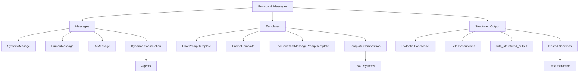

# Prompts, Messages, and Structured Outputs

In this lab, you'll learn the three essential techniques for working with LLMs in LangChain: **messages**, **prompt templates**, and **structured outputs**. Understanding these techniques is key, because modern LangChain applications choose different approaches depending on the use case. Messages provide dynamic construction for flexible workflows like agents, templates provide reusable prompts with variable substitution, and structured outputs ensure type-safe data extraction.

This lab prepares you for both **agents** (using messages) and **RAG systems** (using templates).

## Prerequisites

- Completed [Chat Models & Basic Interactions](../02-chat-models/README.md)

##  Learning Objectives

By the end of this lab, you'll be able to:

-  Understand when to use messages vs templates
-  Construct message arrays for agent workflows
-  Create reusable prompt templates for RAG systems
-  Use variables and dynamic content in prompts
-  Implement few-shot prompting (teaching by example)
-  Generate structured outputs with Pydantic models
-  Choose the right approach for your use case

---

##  Decision Framework: Messages vs Templates

**Before diving into code, understand when to use each approach**:


| Approach | Use For | Lab |
|----------|---------|---------|
| **Messages** | Agents, dynamic workflows, multi-step reasoning, tool integration | [Getting Started with Agents](../05-agents/README.md) |
| **Templates** | Reusable prompts, variable substitution, consistency, RAG systems | [Documents, Embeddings & Semantic Search](../07-documents-embeddings-semantic-search/README.md) |

**Both approaches are valuable**: Messages for dynamic workflows, templates for reusability and consistency.

---

## PART 1: Message-Based Prompting

Message arrays are the foundation of agent systems in LangChain. When you work with agents, you'll use message arrays as input and output.

### The Conversation Analogy


Think of communicating with an AI like having a conversation. Just like in human conversation, there are different types of messages:

- **System Message**: The "ground rules" - like telling someone before a conversation that they're playing a character
- **Human Message**: What you say
- **AI Message**: What the AI responds with

### Quick Reference: Message Types

| Message Type | Purpose | Example |
|-------------|---------|---------|
| `SystemMessage` | Set AI behavior and context | "You are a helpful Python tutor" |
| `HumanMessage` | User input | "How do I write a for loop?" |
| `AIMessage` | AI responses (for conversation history) | "Here's how you write a for loop..." |

### Example 1: Messages vs Templates

This foundational example compares both approaches side-by-side, showing you the key differences in syntax and usage.

**Code**: [`code/01_messages_vs_templates.py`](./code/01_messages_vs_templates.py)  
**Run**: `python 03-prompts-messages-outputs/code/01_messages_vs_templates.py`

**Example code:**

```python
from langchain_openai import ChatOpenAI
from langchain_core.messages import HumanMessage, SystemMessage
from langchain_core.prompts import ChatPromptTemplate
from dotenv import load_dotenv
import os

load_dotenv()

def main():
    model = ChatOpenAI(
        model=os.getenv("AI_MODEL"),
        base_url=os.getenv("AI_ENDPOINT"),
        api_key=os.getenv("AI_API_KEY"),
    )

    # APPROACH 1: Messages (Dynamic - great for agents)
    print("APPROACH 1: Message Arrays\n")

    messages = [
        SystemMessage(content="You are a helpful translator."),
        HumanMessage(content="Translate 'Hello, world!' to French"),
    ]

    message_response = model.invoke(messages)
    print("Response:", message_response.content)

    # APPROACH 2: Templates (Reusable - great for RAG)
    print("\nAPPROACH 2: Templates\n")

    template = ChatPromptTemplate.from_messages([
        ("system", "You are a helpful translator."),
        ("human", "Translate '{text}' to {language}"),
    ])

    template_chain = template | model
    template_response = template_chain.invoke({
        "text": "Hello, world!",
        "language": "French",
    })

    print("Response:", template_response.content)

if __name__ == "__main__":
    main()
```

### Expected Output

```text
APPROACH 1: Message Arrays

Response: "Bonjour, le monde !"

APPROACH 2: Templates

Response: "Bonjour, le monde !"
```

### How It Works

**Message Arrays**:
- Direct construction using `SystemMessage()` and `HumanMessage()`
- Passed directly to `model.invoke(messages)`
- No templating or variable substitution
- Used by agents in LangChain for dynamic workflows

**Templates**:
- Created with `ChatPromptTemplate.from_messages()`
- Uses variables like `{text}` and `{language}`
- Piped to model using `|` operator: `template | model`
- Valuable for reusability and consistency in RAG systems

---

### Example 2: Dynamic Message Construction

Learn how to build message arrays programmatically and use few-shot prompting with messages.

**Code**: [`code/02_message_construction.py`](./code/02_message_construction.py)  
**Run**: `python 03-prompts-messages-outputs/code/02_message_construction.py`

**Example code:**

```python
from langchain_openai import ChatOpenAI
from langchain_core.messages import HumanMessage, SystemMessage, AIMessage, BaseMessage
from dotenv import load_dotenv
import os
from typing import List

load_dotenv()

def create_conversation(role: str, examples: List[dict], new_question: str) -> List[BaseMessage]:
    """Build message arrays programmatically."""
    messages: List[BaseMessage] = [SystemMessage(content=f"You are a {role}.")]
    
    # Add few-shot examples
    for example in examples:
        messages.append(HumanMessage(content=example["question"]))
        messages.append(AIMessage(content=example["answer"]))
    
    messages.append(HumanMessage(content=new_question))
    return messages

def main():
    model = ChatOpenAI(
        model=os.getenv("AI_MODEL"),
        base_url=os.getenv("AI_ENDPOINT"),
        api_key=os.getenv("AI_API_KEY"),
    )

    # Few-Shot Learning with Messages
    emoji_messages = create_conversation(
        "emoji translator",
        [
            {"question": "happy", "answer": "😊"},
            {"question": "sad", "answer": "😢"},
            {"question": "excited", "answer": "🎉"},
        ],
        "surprised",
    )

    print(f"Messages constructed: {len(emoji_messages)}")
    response = model.invoke(emoji_messages)
    print(f"AI Response: {response.content}")  # Expected: 😮

if __name__ == "__main__":
    main()
```

### Expected Output

```text
Messages constructed: 8
AI Response: 😮
```

### How It Works

1. **Dynamic Construction**: Messages are built programmatically based on inputs
2. **Few-Shot Learning**: Teaching by example using `AIMessage` for past responses
3. **Pattern Recognition**: The model learns from examples to produce similar outputs

---

## PART 2: Template-Based Prompting

Templates allow you to create reusable, maintainable prompts with variables. Think of them like "mail merge" - same format, different values.

### The Mail Merge Analogy


Templates work like mail merge in word processors:
- Create a template once with placeholders (`{name}`, `{product}`)
- Reuse it with different values
- Perfect for consistent, repeatable prompts

### Example 3: Basic Templates

Create reusable prompt templates with variable substitution.

**Code**: [`code/03_basic_template.py`](./code/03_basic_template.py)  
**Run**: `python 03-prompts-messages-outputs/code/03_basic_template.py`

**Example code:**

```python
from langchain_core.prompts import ChatPromptTemplate
from langchain_openai import ChatOpenAI
from dotenv import load_dotenv
import os

load_dotenv()

def main():
    # Create a reusable template
    template = ChatPromptTemplate.from_messages([
        ("system", "You are a helpful assistant that translates {input_language} to {output_language}."),
        ("human", "{text}"),
    ])

    model = ChatOpenAI(
        model=os.getenv("AI_MODEL"),
        base_url=os.getenv("AI_ENDPOINT"),
        api_key=os.getenv("AI_API_KEY"),
    )

    # Use the template multiple times with different values
    chain = template | model

    result1 = chain.invoke({
        "input_language": "English",
        "output_language": "French",
        "text": "Hello, how are you?",
    })

    print("French:", result1.content)

    result2 = chain.invoke({
        "input_language": "English",
        "output_language": "Spanish",
        "text": "Hello, how are you?",
    })

    print("Spanish:", result2.content)

if __name__ == "__main__":
    main()
```

### Expected Output

```text
French: Bonjour, comment allez-vous ?
Spanish: ¡Hola, cómo estás?
```

### How It Works

1. **Define Once**: Create the template with placeholders
2. **Reuse Many**: Call `.invoke()` with different values
3. **Chain Pattern**: Use `template | model` to create a reusable chain

---

### Example 4: Template Formats

LangChain supports different template formats. Compare `ChatPromptTemplate` (for chat models) with `PromptTemplate` (for single prompts).

**Code**: [`code/04_template_formats.py`](./code/04_template_formats.py)  
**Run**: `python 03-prompts-messages-outputs/code/04_template_formats.py`

**Example code:**

```python
from langchain_core.prompts import ChatPromptTemplate, PromptTemplate
from langchain_openai import ChatOpenAI
from dotenv import load_dotenv
import os

load_dotenv()

def main():
    model = ChatOpenAI(
        model=os.getenv("AI_MODEL"),
        base_url=os.getenv("AI_ENDPOINT"),
        api_key=os.getenv("AI_API_KEY"),
    )

    # ChatPromptTemplate - for multi-turn conversations
    chat_template = ChatPromptTemplate.from_messages([
        ("system", "You are a helpful {role}."),
        ("human", "{question}"),
    ])

    chat_chain = chat_template | model
    result1 = chat_chain.invoke({"role": "math tutor", "question": "What is 2+2?"})
    print("ChatPromptTemplate:", result1.content)

    # PromptTemplate - for simple single prompts
    simple_template = PromptTemplate.from_template(
        "Answer this {topic} question briefly: {question}"
    )

    simple_chain = simple_template | model
    result2 = simple_chain.invoke({"topic": "science", "question": "Why is the sky blue?"})
    print("PromptTemplate:", result2.content)

if __name__ == "__main__":
    main()
```

### Expected Output

```text
ChatPromptTemplate: 2 + 2 equals 4.
PromptTemplate: The sky appears blue because of Rayleigh scattering...
```

### How It Works

| Template Type | Use Case | Syntax |
|--------------|----------|--------|
| `ChatPromptTemplate` | Multi-turn conversations with roles | `from_messages([("role", "content")])` |
| `PromptTemplate` | Simple single prompts | `from_template("text with {variables}")` |

---

### Example 5: Few-Shot Prompting with Templates

Teach the AI by providing examples. This is one of the most powerful prompting techniques.


**Code**: [`code/05_few_shot.py`](./code/05_few_shot.py)  
**Run**: `python 03-prompts-messages-outputs/code/05_few_shot.py`

**Example code:**

```python
from langchain_core.prompts import ChatPromptTemplate, FewShotChatMessagePromptTemplate
from langchain_openai import ChatOpenAI
from dotenv import load_dotenv
import os

load_dotenv()

def main():
    model = ChatOpenAI(
        model=os.getenv("AI_MODEL"),
        base_url=os.getenv("AI_ENDPOINT"),
        api_key=os.getenv("AI_API_KEY"),
    )

    # Teaching examples
    examples = [
        {"input": "happy", "output": "😊"},
        {"input": "sad", "output": "😢"},
        {"input": "excited", "output": "🎉"},
    ]

    # Example template
    example_template = ChatPromptTemplate.from_messages([
        ("human", "{input}"),
        ("ai", "{output}"),
    ])

    # Few-shot template
    few_shot_template = FewShotChatMessagePromptTemplate(
        example_prompt=example_template,
        examples=examples,
    )

    # Final template combining system message + examples + user input
    final_template = ChatPromptTemplate.from_messages([
        ("system", "You are an emoji translator. Convert words to emojis."),
        few_shot_template,
        ("human", "{input}"),
    ])

    chain = final_template | model

    # Test with new inputs
    for word in ["angry", "love", "confused"]:
        result = chain.invoke({"input": word})
        print(f"{word} → {result.content}")

if __name__ == "__main__":
    main()
```

### Expected Output

```text
angry → 😠
love → ❤️
confused → 😕
```

### How It Works

1. **Define Examples**: Create input/output pairs that demonstrate the pattern
2. **Example Template**: Define how each example should be formatted
3. **Few-Shot Template**: Wrap examples in `FewShotChatMessagePromptTemplate`
4. **Combine**: Add system message, examples, and user input together

---

### Example 6: Template Composition

Build complex prompts by combining smaller templates together.

**Code**: [`code/06_composition.py`](./code/06_composition.py)  
**Run**: `python 03-prompts-messages-outputs/code/06_composition.py`

**Example code:**

```python
from langchain_core.prompts import ChatPromptTemplate
from langchain_openai import ChatOpenAI
from dotenv import load_dotenv
import os

load_dotenv()

def main():
    model = ChatOpenAI(
        model=os.getenv("AI_MODEL"),
        base_url=os.getenv("AI_ENDPOINT"),
        api_key=os.getenv("AI_API_KEY"),
    )

    # Base template with common elements
    base_instructions = """You are a {role} assistant.
Your communication style is {style}.
Always be helpful and professional."""

    # Compose templates for different use cases
    educator_template = ChatPromptTemplate.from_messages([
        ("system", base_instructions),
        ("system", "Focus on teaching concepts clearly with examples."),
        ("human", "{question}"),
    ])

    support_template = ChatPromptTemplate.from_messages([
        ("system", base_instructions),
        ("system", "Focus on solving problems efficiently."),
        ("human", "{question}"),
    ])

    # Use the educator template
    educator_chain = educator_template | model
    result = educator_chain.invoke({
        "role": "Python programming",
        "style": "friendly and encouraging",
        "question": "What is a list comprehension?",
    })

    print("Educator Response:")
    print(result.content)

if __name__ == "__main__":
    main()
```

### Expected Output

```text
Educator Response:
A list comprehension is a concise way to create lists in Python! 

Instead of writing:
squares = []
for x in range(5):
    squares.append(x**2)

You can write:
squares = [x**2 for x in range(5)]

Both produce [0, 1, 4, 9, 16]. List comprehensions are more readable and Pythonic!
```

### How It Works

1. **Base Instructions**: Define common elements used across templates
2. **Specialized Templates**: Add specific instructions for each use case
3. **Compose**: Combine base + specialized + user input

---

## PART 3: Structured Outputs with Pydantic

Use Pydantic models to get type-safe, structured data from LLMs. This ensures you get exactly the data structure you need.

### The Schema Analogy


Think of structured outputs like a form:
- You define the fields (name, email, age)
- The AI fills in the form
- You get validated, typed data back

### Example 7: Basic Structured Output

Extract structured data using Pydantic models with `with_structured_output()`.

**Code**: [`code/07_structured_output.py`](./code/07_structured_output.py)  
**Run**: `python 03-prompts-messages-outputs/code/07_structured_output.py`

**Example code:**

```python
from langchain_openai import ChatOpenAI
from pydantic import BaseModel, Field
from dotenv import load_dotenv
import os

load_dotenv()

# Define your output schema with Pydantic
class Person(BaseModel):
    """Schema for person information."""
    name: str = Field(description="The person's full name")
    age: int = Field(description="The person's age in years")
    occupation: str = Field(description="The person's job or profession")

def main():
    model = ChatOpenAI(
        model=os.getenv("AI_MODEL"),
        base_url=os.getenv("AI_ENDPOINT"),
        api_key=os.getenv("AI_API_KEY"),
    )

    # Create a structured output model
    structured_model = model.with_structured_output(Person)

    text = "John Smith is a 35-year-old software engineer from Seattle."

    result = structured_model.invoke(f"Extract person information from: {text}")

    # Access typed fields directly
    print(f"Name: {result.name}")
    print(f"Age: {result.age}")
    print(f"Occupation: {result.occupation}")

if __name__ == "__main__":
    main()
```

### Expected Output

```text
Name: John Smith
Age: 35
Occupation: software engineer
```

### How It Works

1. **Define Schema**: Create a Pydantic `BaseModel` with typed fields
2. **Add Descriptions**: Use `Field(description="...")` to guide the AI
3. **Create Structured Model**: Call `model.with_structured_output(Schema)`
4. **Get Typed Data**: Result is a Pydantic model instance with typed attributes

---

### Example 8: Complex Pydantic Schemas

Build more sophisticated schemas with nested objects, enums, and validation.

**Code**: [`code/08_pydantic_schemas.py`](./code/08_pydantic_schemas.py)  
**Run**: `python 03-prompts-messages-outputs/code/08_pydantic_schemas.py`

**Example code:**

```python
from langchain_openai import ChatOpenAI
from pydantic import BaseModel, Field
from typing import Literal
from dotenv import load_dotenv
import os

load_dotenv()

# Complex schema with nested objects and enums
class Address(BaseModel):
    """Address information."""
    street: str = Field(description="Street address")
    city: str = Field(description="City name")
    country: str = Field(description="Country name")

class Company(BaseModel):
    """Company information with nested address."""
    name: str = Field(description="Company name")
    industry: Literal["Technology", "Finance", "Healthcare", "Retail", "Other"] = Field(
        description="Industry sector"
    )
    employee_count: int = Field(description="Number of employees")
    headquarters: Address = Field(description="Company headquarters location")
    is_public: bool = Field(description="Whether the company is publicly traded")

def main():
    model = ChatOpenAI(
        model=os.getenv("AI_MODEL"),
        base_url=os.getenv("AI_ENDPOINT"),
        api_key=os.getenv("AI_API_KEY"),
    )

    structured_model = model.with_structured_output(Company)

    text = """
    Microsoft Corporation is a technology giant headquartered in Redmond, Washington, USA.
    The company has approximately 220,000 employees worldwide and is publicly traded on NASDAQ.
    """

    result = structured_model.invoke(f"Extract company information from: {text}")

    print(f"Company: {result.name}")
    print(f"Industry: {result.industry}")
    print(f"Employees: {result.employee_count:,}")
    print(f"Location: {result.headquarters.city}, {result.headquarters.country}")
    print(f"Public: {result.is_public}")

if __name__ == "__main__":
    main()
```

### Expected Output

```text
Company: Microsoft Corporation
Industry: Technology
Employees: 220,000
Location: Redmond, USA
Public: True
```

### How It Works

1. **Nested Models**: Define `Address` and use it inside `Company`
2. **Literal Types**: Use `Literal["A", "B", "C"]` for enum-like constraints
3. **Validation**: Pydantic validates types automatically
4. **Access Nested Data**: Use dot notation like `result.headquarters.city`

---

##  Progress Checkpoint

Before moving on, make sure you can:

| Skill | Check |
|-------|-------|
| Construct message arrays with `SystemMessage`, `HumanMessage`, `AIMessage` |  |
| Create reusable templates with `ChatPromptTemplate` |  |
| Use variables in templates with `{placeholder}` syntax |  |
| Implement few-shot prompting with `FewShotChatMessagePromptTemplate` |  |
| Define Pydantic schemas for structured output |  |
| Extract typed data using `with_structured_output()` |  |
| Choose between messages and templates for different use cases |  |

---

##  Concept Map



---

##  Key Takeaways

### Messages vs Templates

| Aspect | Messages | Templates |
|--------|----------|-----------|
| **Best For** | Agents, dynamic workflows | RAG, reusable prompts |
| **Flexibility** | High - build programmatically | Medium - predefined structure |
| **Reusability** | Lower - often one-off | High - define once, use many |
| **Complexity** | Can get complex with long histories | Easier to maintain |

### Structured Outputs

- **Pydantic** is the Python equivalent of Zod in JavaScript
- Use `Field(description="...")` to guide the AI
- Nested models allow complex data structures
- `Literal` types constrain values to specific options

### When to Use What

1. **Building an agent?** → Use message arrays
2. **Building RAG?** → Use templates
3. **Need consistent data?** → Use structured outputs
4. **Teaching by example?** → Use few-shot prompting

---

##  Assignment

Ready to practice? Complete the challenges in [`assignment.md`](./assignment.md):

1. **Few-Shot Format Teacher** - Teach the AI a custom JSON format
2. **Product Data Extractor** - Extract structured product data with Pydantic
