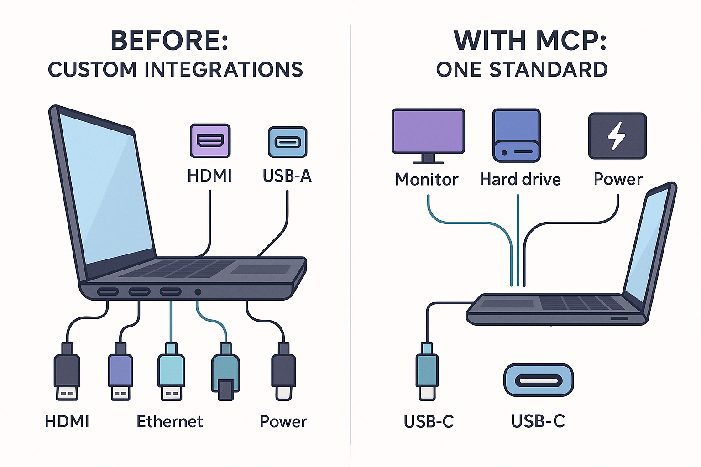
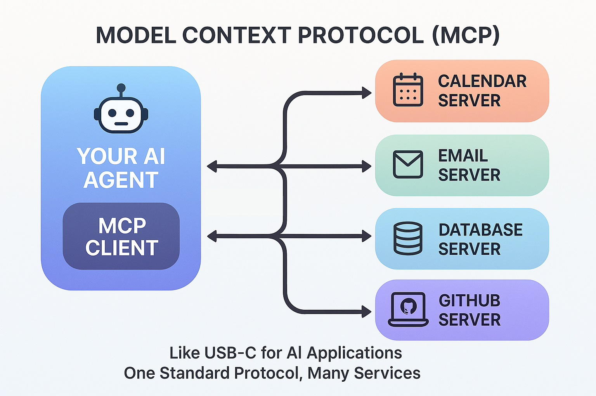
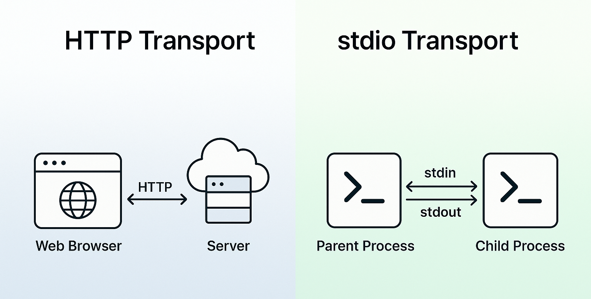
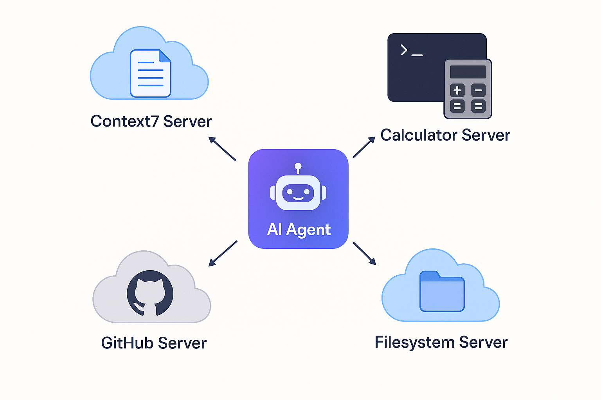
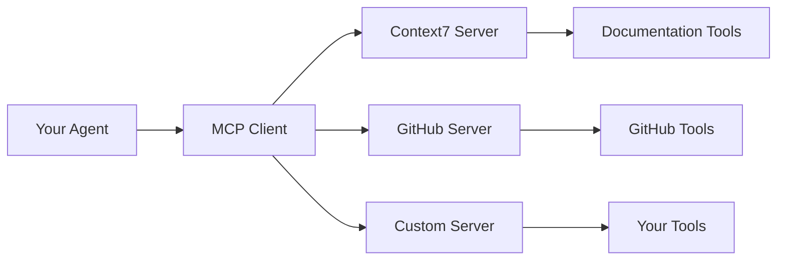

# Model Context Protocol (MCP)

In this lab, you'll learn how to connect AI agents to external services using the **Model Context Protocol (MCP)**—an open standard that provides a universal interface for AI applications to access tools and data sources. You'll discover how MCP simplifies integration with services like GitHub, databases, and documentation systems, and how to use MCP tools seamlessly with the agents you built in [Getting Started with Agents](../05-agents/README.md).

## Prerequisites

- Completed [Getting Started with Agents](../05-agents/README.md)

##  Learning Objectives

By the end of this lab, you'll be able to:

-  Understand what Model Context Protocol (MCP) is and why it matters
-  Connect to external MCP servers using **Streamable HTTP transport**
-  Use **stdio transport** for subprocess communication
-  Integrate MCP tools with LangChain agents (same `create_agent()` pattern!)
-  Work with **multiple MCP servers simultaneously** in one agent
-  Implement **robust error handling** (retries, timeouts, fallbacks)
-  Choose the right transport type for your use case
-  Build and deploy **custom MCP servers** to expose your own tools
-  Troubleshoot common MCP connection and integration issues

---

##  About the Code Examples

The code snippets shown in this README are simplified for clarity and focus on core concepts. The actual code files in the `code/`, `solution/`, and `samples/` folders include:

-  **Enhanced console output** with detailed logging and formatting
- ️ **Production-ready error handling** with comprehensive try-except blocks
-  **Environment variable support** for flexible configuration
-  **Extended educational comments** explaining MCP concepts

When you run the actual files, you'll see more detailed output than shown in the examples below.

---

##  The USB-C for AI Analogy

**Imagine building a laptop that needs to connect to various peripherals:**

### Before USB-C (Custom Integrations)
-  Different port for each device (HDMI, DisplayPort, USB-A, Ethernet, power)
-  Custom drivers and protocols for each
-  Bulky laptop with many specialized ports
- ️ A lot of work to add support for new devices

### With USB-C (MCP Standard)
-  One universal port for everything
-  Standardized protocol all devices understand
-  Slim laptop with fewer ports
-  Quicker to add support for new devices



*MCP provides a standardized way for AI agents to connect to tools - like USB-C for AI applications.*

---

##  Model Context Protocol (MCP)

**You've built agents with manually created tools, but what about connecting to external services?**

In [Getting Started with Agents](../05-agents/README.md), you created tools (calculator, weather, search) by writing the implementation code yourself. This works great for custom tools specific to your application.

**But what about connecting to existing services or cases where tools need to be used across different AI applications?** Imagine needing tools for:
- GitHub (create issues, search code, manage PRs)
- Calendar (check availability, create events)
- Your company database (query data, get schemas)
- Documentation systems (fetch docs, resolve references)

Writing custom integrations for each service means dealing with different APIs, authentication methods, and data formats. This is where **Model Context Protocol (MCP)** comes in.

### What is MCP?

**Model Context Protocol (MCP)** is an open standard that lets AI applications connect to external tools and data sources through a universal interface. It's like USB-C for AI applications.

**The Problem**: Building an AI assistant that needs to access Calendar details, databases, GitHub, and more means writing custom integrations for each service with different APIs, auth methods, and data formats.

**The MCP Solution**: Services expose their capabilities through a standard protocol. Your agent connects once and gets access to everything.

### Architecture



*MCP provides a standardized way for AI agents to connect to external services - like USB-C for AI applications.*

Each **MCP Server** is a program that exposes tools through the protocol. Your agent connects and can use all available tools.

### Transport Types

MCP defines two standard transport mechanisms for client-server communication:

| Transport | Communication Method | When to Use | Example |
|-----------|---------------------|-------------|---------|
| **Streamable HTTP** | Network-based (client → server over network) | When MCP server is accessed via URL (local or remote) | `{"transport": "streamable_http", "url": "https://api.mycompany.com/mcp"}` |
| **stdio** | Process-based (parent  child via streams) | When MCP server runs as subprocess of your application | `{"transport": "stdio", "command": "python", "args": ["server.py"]}` |

> ** Note on Transport Evolution**: The current MCP specification uses **Streamable HTTP** as the standard network transport. In LangChain Python code, you use `transport: "streamable_http"` - the library handles the protocol automatically.

**Understanding stdin and stdout**:
- **stdin** (standard input): Where a program reads input - like text from keyboard or piped data
- **stdout** (standard output): Where a program writes output - like text to console or screen
- With stdio transport, the client and server talk to each other through these streams, like two programs connected by a pipe



*Streamable HTTP transport uses network-based communication, while stdio uses process-based communication.*

> ** Architecture Choice**: Streamable HTTP is for *network-accessible* servers (think: web service). stdio is for *process-integrated* tools (think: subprocess).

### Why MCP Matters

| Without MCP | With MCP |
|-------------|----------|
| Custom integration per service | One standard protocol |
| Separate auth for each | Unified approach |
| Time intensive to add services | Quicker to add services |

**The key insight**: In [Getting Started with Agents](../05-agents/README.md), you built the tool *implementations*. With MCP, you connect to tool *providers* that expose their capabilities through a standard protocol. Same `create_agent()` pattern, different tool source!

### Using MCP in LangChain

LangChain provides the `langchain-mcp-adapters` package for MCP integration:

```bash
pip install langchain-mcp-adapters
```

Now let's see how to connect to an MCP server and use its tools with `create_agent()`.

---

##  Building Agents with MCP Tools

### Example 1: Agent with MCP Server Integration (Context7)

This example shows how to use `MultiServerMCPClient` to connect to Context7 (a documentation MCP server) and use its tools with `create_agent()`. It's the same agent pattern you've learned, but tools can be accessed and used in a more standardized way.

**Key code you'll work with:**
```python
from langchain_mcp_adapters.client import MultiServerMCPClient

client = MultiServerMCPClient({
    "context7": {
        "transport": "streamable_http",  # Uses Streamable HTTP protocol
        "url": "https://mcp.context7.com/mcp"  # Remote MCP server
    }
})

# Get tools from MCP server - that's it!
tools = await client.get_tools()

# Same create_agent() pattern, different tool source
agent = create_agent(model, tools)  # Tools from MCP server instead of manually created
```

**Code**: [`code/01_mcp_integration.py`](./code/01_mcp_integration.py)  
**Run**: `python 06-mcp/code/01_mcp_integration.py`

**About Context7**: A documentation MCP server that provides current library docs. It offers two tools:
- `resolve-library-id`: Converts library names (e.g., "React") to Context7 IDs
- `get-library-docs`: Retrieves documentation with optional topic filtering

**Example code:**

```python
import asyncio
import os

from dotenv import load_dotenv
from langchain.agents import create_agent
from langchain_mcp_adapters.client import MultiServerMCPClient
from langchain_openai import ChatOpenAI

load_dotenv()


async def main():
    # Context7 MCP Server - provides documentation for libraries
    mcp_server_url = os.getenv("MCP_SERVER_URL", "https://mcp.context7.com/mcp")

    # Create MCP client with HTTP transport to Context7
    client = MultiServerMCPClient({
        "context7": {
            "transport": "streamable_http",
            "url": mcp_server_url,
        }
    })

    try:
        # 1. Get all available tools from Context7
        print(" Fetching tools from Context7 MCP server...")
        tools = await client.get_tools()

        print(f" Retrieved {len(tools)} tools from Context7:")
        for tool in tools:
            print(f"   • {tool.name}: {tool.description}")

        # 2. Create model
        model = ChatOpenAI(
            model=os.getenv("AI_MODEL"),
            base_url=os.getenv("AI_ENDPOINT"),
            api_key=os.getenv("AI_API_KEY"),
        )

        # 3. Create agent with MCP tools - same create_agent() pattern!
        agent = create_agent(model, tools)

        # 4. Use the agent to get documentation
        query = "How do I use Python requests library to make HTTP GET requests? Get the latest documentation."
        print(f" User: {query}\n")

        response = await agent.ainvoke({"messages": [("human", query)]})
        last_message = response["messages"][-1]

        print(f" Agent: {last_message.content}\n")

    finally:
        print(" MCP client connection closed")


if __name__ == "__main__":
    asyncio.run(main())
```

> ** Simplification Note**: The actual code file uses `os.getenv("MCP_SERVER_URL", "https://mcp.context7.com/mcp")` with environment variable support. The snippet above is simplified to show the core concept. See the full file for production patterns.

### Expected Output

```
 MCP Integration Demo - Context7 Documentation Server

 Connecting to MCP server at: https://mcp.context7.com/mcp

 Fetching tools from Context7 MCP server...
 Retrieved 2 tools from Context7:
   • resolve-library-id: Converts library names to Context7-compatible IDs
   • get-library-docs: Retrieves documentation with optional topic filtering

 Creating agent with MCP tools...

 User: How do I use Python requests library to make HTTP GET requests? Get the latest documentation.

 Agent: The `requests` library is Python's most popular HTTP client. 
Here's how to make a GET request...

 Key Concepts:
   • MCP provides standardized access to external tools
   • Same create_agent() pattern, different tool source!

 MCP client connection closed
```

---

### Example 2: MCP with stdio Transport

This example shows how to use **stdio transport** to run an MCP server as a subprocess. Unlike HTTP (which communicates over network), stdio uses standard input/output streams for communication.

**Key code you'll work with:**
```python
from pathlib import Path

# Run MCP server as a local subprocess
client = MultiServerMCPClient({
    "localCalculator": {
        "transport": "stdio",  # Local subprocess, not HTTP!
        "command": "python",
        "args": [str(Path(__file__).parent / "servers" / "stdio_calculator_server.py")]
    }
})

# Same agent pattern, different transport type
tools = await client.get_tools()
agent = create_agent(model, tools)
```

**Server**: [`code/servers/stdio_calculator_server.py`](./code/servers/stdio_calculator_server.py)  
**Code**: [`code/02_mcp_stdio_local.py`](./code/02_mcp_stdio_local.py)  
**Run**: `python 06-mcp/code/02_mcp_stdio_local.py`

**Transport Comparison**:

| Feature | Streamable HTTP (Example 1) | stdio (Example 2) |
|---------|-----------------|-------------------|
| **Communication** | Network-based (HTTP requests) | Process-based (stdin/stdout streams) |
| **Server Deployment** | Runs independent of client | Runs as subprocess of client |
| **Connection** | Client connects via URL | Client spawns and manages process |
| **Lifecycle** | Server runs independently | Server lifecycle tied to client |
| **Best For** | Network-accessible services (local or remote) | Process-integrated tools (tight coupling) |

**Both transports can**:
-  Authenticate users (Streamable HTTP: tokens/keys, stdio: subprocess credentials)
-  Access network resources (Streamable HTTP: directly, stdio: subprocess can make network calls)
-  Be used in production (choice depends on architecture and needs)

> ** The Real Difference**:
> - **Streamable HTTP**: MCP server is a separate web service that clients connect to
> - **stdio**: MCP server is a subprocess accessed directly by the client
>
> Think: Streamable HTTP = calling a web API, stdio = running a program and talking to it.

### Expected Output

```
 Starting local MCP server via stdio...

 Connecting to stdio MCP server...
 Connected! Retrieved 2 tools from local server:
   • calculate: Perform mathematical calculations using Python's math module
   • convert_temperature: Convert temperature between Celsius and Fahrenheit

 Testing calculator tool...

 User: What is 15 * 23 + 100?
 Agent: 15 * 23 + 100 = 445

️  Testing temperature conversion...

 User: Convert 100 degrees Fahrenheit to Celsius
 Agent: 100°F = 37.78°C

 Key Concepts:
   • stdio transport runs MCP server as a subprocess
   • Communicates via standard input/output streams

 MCP client connection closed
```

---

### Example 3: Multi-Server Agent Integration

This example demonstrates the real power of MCP: connecting to **multiple MCP servers simultaneously**. The agent gets tools from all servers and intelligently chooses which to use based on the query!

**Key code you'll work with:**
```python
# Connect to multiple servers at once!
client = MultiServerMCPClient({
    "context7": {
        "transport": "streamable_http",
        "url": "https://mcp.context7.com/mcp"  # Remote docs server
    },
    "calculator": {
        "transport": "stdio",
        "command": "python",
        "args": [str(server_path)]  # Local math server
    }
})

# Agent gets tools from BOTH servers
tools = await client.get_tools()  # Combines tools from all servers
agent = create_agent(model, tools)

# Agent chooses the right tool for each task automatically!
```



*One AI Agent connecting to multiple MCP servers simultaneously - Context7 for documentation, Calculator for math, GitHub for code, and Filesystem for file operations.*

**Code**: [`code/03_mcp_multi_server.py`](./code/03_mcp_multi_server.py)  
**Run**: `python 06-mcp/code/03_mcp_multi_server.py`

**What makes this powerful:**
-  Mix different transport types (Streamable HTTP + stdio)
-  Combine tools from different services
-  Agent automatically routes queries to appropriate tools
-  Scale to dozens of servers without changing agent code
-  Real-world example: GitHub + Calendar + Database + Documentation in one agent

**Real-World Use Cases:**
- Documentation (Context7) + Math (Calculator) + Weather (API)
- GitHub (code) + Calendar (scheduling) + Database (data queries)
- Internal company tools + External services in unified interface

### Expected Output

```
 Connecting to multiple MCP servers...

 Fetching tools from all servers...
 Retrieved 4 total tools from 2 servers:

 From Context7 (Documentation):
   • resolve-library-id: Convert library names to Context7 IDs
   • get-library-docs: Retrieve library documentation

 From Local Calculator:
   • calculate: Perform mathematical calculations
   • convert_temperature: Convert temperature between units

Test 1: Math question (should use calculator)

 User: What is 25 * 4 + 100?
 Agent: 25 * 4 + 100 = 200

Test 2: Documentation question (should use Context7)

 User: How do I use FastAPI to create a REST API? Get documentation.
 Agent: FastAPI is a modern, fast web framework for building APIs with Python...

 Key Concepts:
   • Agent receives tools from ALL connected servers
   • Agent automatically chooses the right tool for each task

 All MCP connections closed
```

---

### Example 4: Error Handling & Production Patterns

This example shows **best practices** for handling MCP failures, using LangChain's built-in retry capabilities.

**Key code you'll work with:**
```python
import asyncio

# Create model
model = ChatOpenAI(
    model=os.getenv("AI_MODEL"),
    base_url=os.getenv("AI_ENDPOINT"),
    api_key=os.getenv("AI_API_KEY"),
)

agent = create_agent(model, tools)

# Execute with timeout - prevent indefinite hangs
timeout_seconds = 30
response = await asyncio.wait_for(
    agent.ainvoke({"messages": [("human", query)]}),
    timeout=timeout_seconds
)
```

**Code**: [`code/04_mcp_error_handling.py`](./code/04_mcp_error_handling.py)  
**Run**: `python 06-mcp/code/04_mcp_error_handling.py`

**Patterns covered:**
1. **LangChain's with_retry()** - Built-in exponential backoff (no custom code!)
2. **Connection health checks** - Monitor MCP server availability
3. **Timeout handling** - Prevent indefinite hangs
4. **Graceful degradation** - Continue operating when MCP is down
5. **Fallback strategies** - Use alternative servers or cached data
6. **Proper cleanup** - Always close connections in finally blocks

**Why use with_retry()?**
-  No custom retry loops needed
-  Production-tested exponential backoff
-  Works with all LangChain components
-  Simpler code, fewer bugs

**Production Checklist:**
-  Use model.with_retry() for automatic retries
-  Request timeouts
-  Fallback strategies
-  Health monitoring
-  Error logging/metrics
-  Graceful degradation

### Expected Output

```
️  MCP Error Handling & Retry Patterns

Pattern 1: Primary + Fallback Strategy

 Trying primary server (Context7)...
 Attempting to connect to MCP server...
 Connected! Retrieved 2 tools

 Fetching tools from MCP server...
 Retrieved 2 tools successfully

Pattern 2: Using LangChain's Built-In with_retry()

 Model configured with automatic retry (max 3 attempts)
   - LangChain handles exponential backoff automatically
   - No custom retry loops needed!

Pattern 3: Query Execution with Timeout

 User: How do I use Python's asyncio library? Get the latest documentation.
 Agent: Python's asyncio library provides infrastructure for writing single-threaded
concurrent code using coroutines...

Pattern 4: MCP Server Health Check

 MCP server is healthy

 Health status: HEALTHY

 Error Handling Best Practices:
    Use LangChain's with_retry() for automatic exponential backoff
    Implement fallback servers for high availability

 MCP connection closed gracefully
```

---

##  Additional Agent Patterns

### Example 5: Creating Custom MCP Servers

Want to build your own MCP server to expose custom tools? This example shows how to create a production-ready MCP server that any MCP client can connect to!

**Why create custom servers?**
- Expose your company's internal tools to AI agents
- Wrap existing APIs in MCP standard
- Create reusable tools for your team
- Share your tools with the MCP ecosystem

**Key code you'll work with:**
```python
from mcp.server.fastmcp import FastMCP

# Create MCP server
mcp = FastMCP("my-calculator")

@mcp.tool()
def calculate(expression: str) -> str:
    """
    Perform mathematical calculations.
    
    Args:
        expression: Math expression to evaluate, e.g., '2 + 2', 'sqrt(16)'
    
    Returns:
        The result of the calculation.
    """
    result = eval(expression, {"__builtins__": {}}, safe_namespace)
    return str(result)

# Run with HTTP transport
mcp.run(transport="streamable-http", port=3000)
```

**Complete Implementation**: [`samples/basic_mcp_server.py`](./samples/basic_mcp_server.py) - A production-ready calculator MCP server with:
- Streamable HTTP transport for network access
- Safe expression evaluation with math functions
- Proper error handling

**Run the server**:
```bash
python 06-mcp/samples/basic_mcp_server.py
# Server starts on http://localhost:3000/mcp
```

**Connect to your custom server**:
```python
client = MultiServerMCPClient({
    "myCalculator": {
        "transport": "streamable_http",
        "url": "http://localhost:3000/mcp"
    }
})
```

**Best Practices**:
-  Use descriptive tool names and descriptions
-  Validate input parameters
-  Handle errors gracefully and return helpful messages
-  Add logging for debugging and monitoring
-  Support graceful shutdown (signal handling)

**Learn More**:
- [MCP SDK Documentation](https://modelcontextprotocol.io/docs) - Official SDK reference
- [MCP Registry](https://github.com/mcp) - MCP server implementations

---

### How It Works

**What's Different from Getting Started with Agents**:
1. **Tool Source**: Instead of creating tools manually, you get them from an MCP server
2. **Tool Discovery**: `client.get_tools()` fetches all available tools from the server
3. **Tool Execution**: The MCP client handles communication with the remote server
4. **Same create_agent() Pattern**: The agent works identically - only the tool source changed!

**Benefits of MCP Integration**:
-  **No custom integration code** - MCP handles the connection
-  **Dynamic tool discovery** - Server can add/remove tools without code changes
-  **Standard protocol** - Works with any MCP-compliant server
-  **Production-ready** - Streamable HTTP transport scales for remote deployments

**Setting Up Context7**:

The example works out of the box with the public Context7 server - no configuration needed! The code automatically connects to `https://mcp.context7.com/mcp`.

**Optional customization**:
- To use a local Context7 server instead, set `MCP_SERVER_URL=http://localhost:3000/mcp` in your `.env` file, then run:
  ```bash
  npx -y @upstash/context7-mcp --transport http --port 3000
  ```
- For higher rate limits with the public server, get an API key at [context7.com](https://context7.com) and uncomment the `headers` section in the code

---

##  Key Takeaways

- **MCP is a universal standard** - Like USB-C for AI applications, one protocol for all services
- **Two transport types serve different needs**:
  - **Streamable HTTP**: Network-based communication, works with local or remote servers
  - **stdio**: Process-based communication via standard input/output streams
- **Works seamlessly with agents** - Same `create_agent()` pattern you've already learned about, just a different tool source
- **Multi-server power** - Connect to dozens of servers, agent intelligently chooses right tools
- **Production patterns matter** - Always implement error handling, retries, timeouts, and fallbacks
- **Dynamic tool discovery** - Servers can add/remove tools without client code changes
- **Create your own servers** - Expose company tools, wrap APIs, share with MCP ecosystem
- **Troubleshooting is key** - Know how to debug connection issues, transport problems, and tool failures

---

## ️ Concept Map

This lab taught you how MCP standardizes AI tool integration:



*One client, multiple servers, standardized protocol - that's the power of MCP.*

---

##  Assignment

Ready to practice? Complete the challenges in [assignment.md](./assignment.md)!

The assignment includes:
1. **Connect to MCP Server** - Set up Context7 integration
2. **Build Multi-Server Agent** - Connect to multiple MCP servers
3. **Custom Tool Integration** (Bonus) - Combine MCP tools with manual tools

Then complete the challenge in [assignment2.md](./assignment2.md)

The assignment includes:
1. **Build an MCP server** - Build an MCP server that provides weather information

---

##  Additional Resources

- [Model Context Protocol](https://modelcontextprotocol.io/) - Official MCP specification and documentation
- [LangChain MCP Adapters](https://pypi.org/project/langchain-mcp-adapters/) - LangChain Python MCP integration package
- [MCP Registry](https://github.com/mcp) - Explore available MCP servers
- [Context7 MCP Server](https://github.com/upstash/context7) - Documentation server used in this lab

---

##  Troubleshooting

Common issues you might encounter when working with MCP:

### "Failed to connect to MCP server" or Connection Timeout

**Cause**: MCP server is not running, unreachable, or behind a firewall

**Fixes**:

1. **For Streamable HTTP transport**: Verify the URL is correct and server is running:
```python
# Test the endpoint manually first
url = "https://mcp.context7.com/mcp"
print(f"Testing connection to {url}...")
```

2. **For stdio transport**: Check that the server file path is correct:
```python
# Use absolute path or verify relative path
from pathlib import Path
server_path = Path(__file__).parent / "servers" / "stdio_calculator_server.py"
print(f"Server path: {server_path}")
# Ensure file exists before connecting
```

3. **Add connection timeout and retry logic** (see Example 4):
```python
# Implement timeout with asyncio
import asyncio
tools = await asyncio.wait_for(client.get_tools(), timeout=10.0)
```

---

### "No tools returned from MCP server"

**Cause**: Server is running but not exposing any tools, or authorization failed

**Fixes**:

1. **Check server logs** for errors in tool registration
2. **Verify authentication** if server requires API keys:
```python
client = MultiServerMCPClient({
    "context7": {
        "transport": "streamable_http",
        "url": "https://mcp.context7.com/mcp",
        "headers": {
            "Authorization": f"Bearer {os.getenv('CONTEXT7_API_KEY')}"  # Add auth header
        }
    }
})
```

3. **Test server directly** using a simple MCP client to isolate the issue

---

### "Module not found" for stdio server

**Cause**: Server file path is incorrect or server dependencies not installed

**Fixes**:

1. **Verify path resolution**:
```python
from pathlib import Path

server_path = Path(__file__).parent / "servers" / "stdio_calculator_server.py"
print(f"Server exists: {server_path.exists()}")
```

2. **Check that server file exists**:
```bash
# Verify server file exists
ls 06-mcp/code/servers/stdio_calculator_server.py

# Note: stdio servers run via transport, not manually.
# They communicate via stdin/stdout pipes.
```

3. **Ensure all server dependencies are installed** in your project

---

### Agent doesn't use MCP tools

**Cause**: Tools not properly passed to agent, or tool descriptions unclear

**Fixes**:

1. **Verify tools are retrieved and passed to agent**:
```python
tools = await client.get_tools()
print(f"Retrieved {len(tools)} tools:", [t.name for t in tools])

agent = create_agent(model, tools)  # Ensure tools array is passed here
```

2. **Check tool descriptions are clear** - vague descriptions confuse the agent:
```python
# Tools should have clear, specific descriptions
# MCP server should expose well-described tools
```

3. **Test with explicit tool request** in your query:
```python
query = "Use the calculate tool to compute 5 * 10"
# Being explicit helps verify tools are accessible
```

---

### "Session terminated" or "Transport closed" errors

**Cause**: MCP connection was closed unexpectedly or timeout occurred

**Fixes**:

1. **Implement proper cleanup** with try/finally:
```python
client = MultiServerMCPClient(config)
try:
    # Use MCP client
    tools = await client.get_tools()
    # ... use agent ...
finally:
    # Python MCP client handles cleanup automatically
    pass
```

2. **Handle connection failures gracefully** (see Example 4 for retry patterns)

3. **For stdio transport**: Ensure subprocess doesn't crash:
```bash
# Check server logs for errors
# Servers log to stderr with stdio transport
```

---

### Multiple MCP servers conflict or tools have same name

**Cause**: Different servers exposing tools with identical names

**Fixes**:

1. **MCP automatically namespaces tools** by server, but if conflicts occur:
```python
# Check which server provides which tool
for tool in tools:
    print(f"Tool: {tool.name}, Description: {tool.description}")
```

2. **Rely on tool descriptions** - agent uses descriptions to choose the right tool

3. **Consider renaming tools** in your MCP server implementation if conflicts are problematic

---

### Performance issues with stdio transport

**Cause**: Subprocess startup overhead or communication latency

**Fixes**:

1. **Choose transport based on architecture needs**:
```python
# If MCP server needs to be network-accessible (shared across processes/machines):
http_config = {"transport": "streamable_http", "url": "https://api.myserver.com/mcp"}

# If MCP server is tightly integrated with client process:
stdio_config = {"transport": "stdio", "command": "python", "args": ["server.py"]}
```

2. **Consider keeping server process alive** for repeated calls (advanced)

3. **Cache tool lists** if they don't change between calls

---

##  Dependencies

```bash
pip install langchain langchain-openai langchain-mcp-adapters mcp python-dotenv
```
