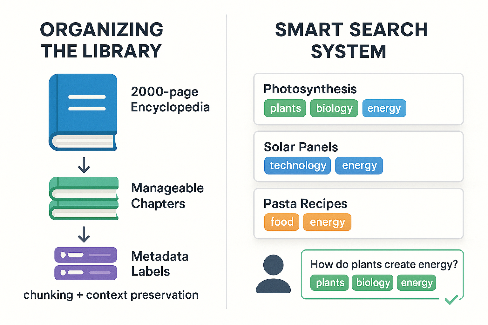
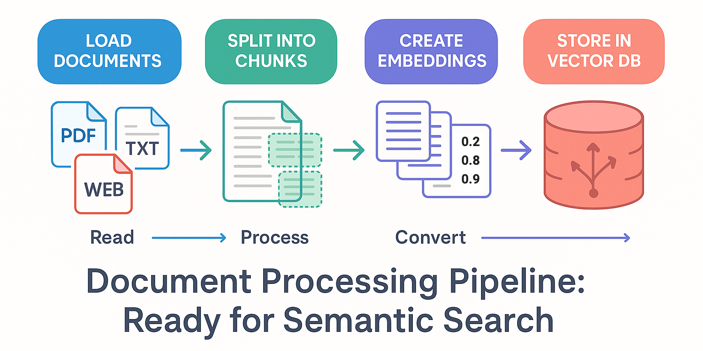
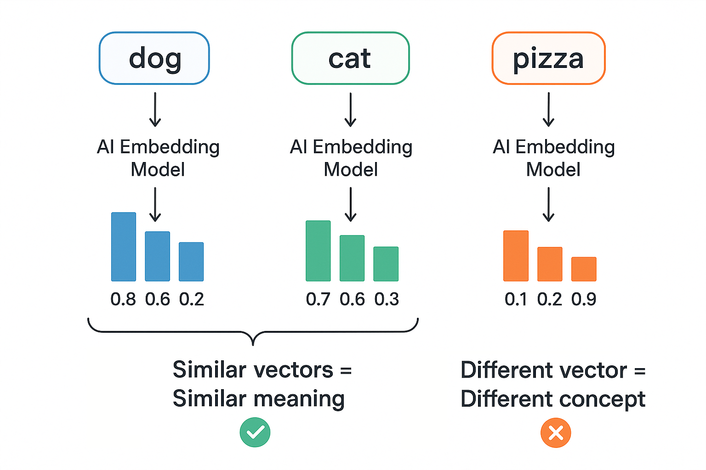
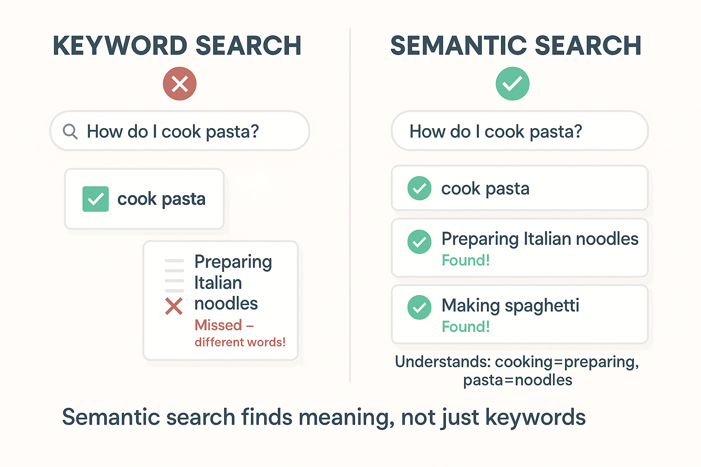

# Documents, Embeddings & Semantic Search

In this lab, you'll learn the complete pipeline for working with documents in AI applications — from loading and preparing documents to enabling intelligent semantic search. You'll discover how to load content from various sources, split it into manageable chunks, convert text into numerical embeddings, and perform similarity searches that understand meaning rather than just matching keywords.

**Why learn this after agents?** You've already built agents that can use tools to solve problems. Now you'll learn how to create **retrieval tools** that give agents the power to search through your documents intelligently. This combination—agents with retrieval capabilities—enables **agentic RAG systems** where AI autonomously decides when and how to search your knowledge base to answer questions. You'll build this powerful pattern in [Building Agentic RAG Systems](../08-agentic-rag-systems/README.md).

## Prerequisites

- Completed [Getting Started with Agents](../05-agents/README.md)
- Environment variables configured (see [Course Setup](../00-course-setup/README.md))

##  Learning Objectives

By the end of this lab, you'll be able to:

-  Load documents from various sources (text, PDF, web)
-  Split long documents into manageable chunks
-  Understand chunking strategies and their trade-offs
-  Work with document metadata
-  Understand what embeddings are and how they work
-  Create embeddings for text using Azure AI models
-  Store embeddings in vector stores
-  Perform semantic similarity searches
-  Build the foundation for RAG systems

---

##  About the Code Examples

The code snippets shown in this README are simplified for clarity and focus on core concepts. The actual code files in the `code/`, `solution/`, and `samples/` folders include:

-  **Enhanced console output** with emojis, separators, and detailed formatting
-  **Additional statistics** and metrics for better understanding
-  **More comprehensive examples** with diverse datasets and multiple queries
-  **Extended educational content** with key insights and observations
- ️ **Robust error handling** with try-except blocks and safe operations

When you run the actual files, you'll see more detailed output than shown in the examples below. This is intentional - the README focuses on teaching concepts, while the code demonstrates production-quality practices.

---

##  Dependencies

The course uses `langchain-openai` for Azure OpenAI embeddings:

```bash
pip install langchain langchain-openai langchain-core langchain-text-splitters langchain-community python-dotenv
```

---

##  Environment Variables

Make sure these environment variables are set:

```bash
AI_ENDPOINT=your-azure-endpoint
AI_API_KEY=your-api-key
AI_EMBEDDING_MODEL=text-embedding-ada-002
```
---

##  The Smart Library System Analogy

**Imagine you're building a modern, intelligent library system.**

### Part 1: Organizing the Library (Document Processing)

When someone donates a massive encyclopedia to your library, you can't:

-  Hand readers the entire 2,000-page book
-  Give them random pages
-  Show them just individual words

Instead, you need to:

- Find the right sections (loading)
- Break it into manageable lessons (chunking)
- Label each piece with metadata (organization)
- Keep some overlap between sections so context isn't lost

### Part 2: The Smart Search System (Embeddings & Semantic Search)

Now imagine each book section gets a special "number tag" that represents its meaning:

- Section about "photosynthesis": `[plants: 0.9, biology: 0.8, energy: 0.7]`
- Section about "solar panels": `[plants: 0.1, technology: 0.9, energy: 0.8]`
- Section about "pasta recipes": `[plants: 0.2, food: 0.9, energy: 0.3]`

> ** Note:** These simplified "named tags" are for illustration. Real embeddings are dense vectors of 1536+ numbers without human-readable labels. Think of them as coordinates in 1536-dimensional semantic space, similar to (latitude, longitude) but with many more dimensions!

When someone asks "How do plants create energy?", the system:

1. Converts their question into numbers: `[plants: 0.9, biology: 0.7, energy: 0.8]`
2. Finds sections with similar numbers
3. Returns the photosynthesis section (perfect match!)

**This is how document processing and semantic search work together!**

LLMs have context limits which means they can only process so much text at once. Document processing prepares your content, and semantic search helps you find what's needed based on *meaning*, not just keyword matching. Powerful!



*The smart library system: Organize documents into chunks with metadata (left), then use semantic search to find relevant content by meaning (right).*

---

##  Part 1: Working with Documents

### Why Document Loaders?

LLMs need text input, but data comes in many formats: text files, PDFs, websites, JSON/CSV, and more. **Document loaders handle the complexity of reading different formats.**



*The document processing pipeline: Load documents → Split into chunks → Create embeddings → Store in vector database, ready for semantic search.*

---

### Example 1: Loading Text Files

Let's see how to use `TextLoader` to read text files and access `page_content` and `metadata`.

**Key code you'll work with:**

```python
# Initialize the loader with a file path
loader = TextLoader("./data/sample.txt")

# Load the document - returns list of Document objects
docs = loader.load()

# Access document properties
print(docs[0].page_content)  # The actual text content
print(docs[0].metadata)       # Metadata like source path
```

**Code**: [`code/01_load_text.py`](./code/01_load_text.py)  
**Run**: `python 07-documents-embeddings-semantic-search/code/01_load_text.py`

**Example code:**

First, create a sample text file:

```python
from langchain_community.document_loaders import TextLoader
from pathlib import Path

# Create sample data
data_dir = Path("./data")
data_dir.mkdir(exist_ok=True)

sample_text = """
LangChain is a framework for building applications with large language models.

It provides tools for:
- Working with different AI providers
- Managing prompts and templates
- Processing and storing documents
- Building RAG systems
- Creating AI agents

The framework is designed to be modular and composable.
"""

(data_dir / "sample.txt").write_text(sample_text.strip())

# Load the document
loader = TextLoader("./data/sample.txt")
docs = loader.load()

print(f"Loaded {len(docs)} document(s)")
print(f"Content: {docs[0].page_content}")
print(f"Metadata: {docs[0].metadata}")
```

### Expected Output

When you run this example with `python 07-documents-embeddings-semantic-search/code/01_load_text.py`, you'll see:

```text
Loaded 1 document(s)
Content: LangChain is a framework for building applications with large language models.

It provides tools for:
- Working with different AI providers
- Managing prompts and templates
...

Metadata: {'source': './data/sample.txt'}
```

### How It Works

**What's happening**:

1. **Create sample data**: We write a text file to `./data/sample.txt`
2. **Initialize TextLoader**: Pass the file path to the loader
3. **Load**: Call `loader.load()` to read the file
4. **Result**: Returns a list of `Document` objects

**Key Points**:

- `TextLoader` reads text files and handles file I/O
- Returns list of `Document` objects (even for single files, for consistency)
- Each document has two main properties:
  - `page_content`: The actual text content
  - `metadata`: Information about the document (source, etc.)
- Metadata automatically includes the source file path

---

## ️ Splitting Documents

### Why Split Documents?

- **LLM context limits**: Models can only process ~4,000-128,000 tokens
- **Relevance**: Smaller chunks = more precise retrieval
- **Cost**: Smaller inputs = lower API costs

### Chunk Size Trade-offs

| Small Chunks (200-500 chars) | Large Chunks (1000-2000 chars) |
|------------------------------|--------------------------------|
|  More precise |  More context |
|  Better for specific questions |  Better for complex topics |
|  May lose context |  Less precise matching |
|  More chunks to process |  Fewer chunks |

### Example 2: Text Splitting

Here you'll split long documents into manageable chunks using `RecursiveCharacterTextSplitter` with configurable chunk size and overlap.

**Key code you'll work with:**

```python
# Create a splitter with chunk size and overlap settings
splitter = RecursiveCharacterTextSplitter(
    chunk_size=300,      # Target size in characters
    chunk_overlap=50,    # Overlap between chunks (preserves context)
)

# Split text into document chunks
docs = splitter.create_documents([text])
```

**Code**: [`code/02_splitting.py`](./code/02_splitting.py)  
**Run**: `python 07-documents-embeddings-semantic-search/code/02_splitting.py`

### Practical Chunk Size Guidelines

**Starting Point**: Use **500 characters** with **100 character overlap** (20%) for most use cases.

**Adjust based on results**:

- Too few results → Increase chunk size
- Results too generic → Decrease chunk size
- Missing context at boundaries → Increase overlap

---

##  Chunk Overlap

**Why overlap chunks?** Without overlap, "the mitochondria is the | powerhouse of the cell" splits mid-sentence, losing context. With overlap, both chunks include "is the powerhouse," preserving meaning.

**Recommended overlap**: Start with 20% of chunk size (e.g., 100 chars for 500-char chunks).

### Example 3: Comparing Chunk Overlap

**Code**: [`code/03_overlap.py`](./code/03_overlap.py)  
**Run**: `python 07-documents-embeddings-semantic-search/code/03_overlap.py`

This example compares chunks with and without overlap to show how overlap preserves context.

---

## ️ Document Metadata

Metadata helps you:

- Track document source
- Filter by category, date, author
- Understand context

### Example 4: Working with Metadata

**Code**: [`code/04_metadata.py`](./code/04_metadata.py)  
**Run**: `python 07-documents-embeddings-semantic-search/code/04_metadata.py`

**Key code you'll work with:**

```python
# Create document with custom metadata
doc = Document(
    page_content="LangChain is a framework...",
    metadata={
        "source": "langchain-guide.md",
        "category": "tutorial",
        "date": "2024-01-15",
        "author": "Tech Team",
    },
)

# Metadata is preserved when splitting
split_docs = splitter.split_documents([doc])
# Each chunk retains the original metadata!
```

---

##  Part 2: Embeddings

### What Are Embeddings?

Embeddings convert text into numerical vectors that capture semantic meaning:

- Similar concepts → Similar vectors
- "king" - "man" + "woman" ≈ "queen"



*Embeddings map text to points in semantic space where similar meanings are close together.*

### Example 5: Creating Embeddings with Azure AI

**Code**: [`code/05_basic_embeddings.py`](./code/05_basic_embeddings.py)  
**Run**: `python 07-documents-embeddings-semantic-search/code/05_basic_embeddings.py`

**Key code you'll work with:**

```python
import os
from dotenv import load_dotenv
from langchain_openai import AzureOpenAIEmbeddings

load_dotenv()

def get_embeddings_endpoint():
    """Get the Azure OpenAI endpoint, removing /openai/v1 suffix if present."""
    endpoint = os.getenv("AI_ENDPOINT", "")
    if endpoint.endswith("/openai/v1"):
        endpoint = endpoint.replace("/openai/v1", "")
    return endpoint

# Initialize Azure OpenAI embeddings model
embeddings = AzureOpenAIEmbeddings(
    azure_endpoint=get_embeddings_endpoint(),
    api_key=os.getenv("AI_API_KEY"),
    model=os.getenv("AI_EMBEDDING_MODEL", "text-embedding-ada-002"),
    api_version="2024-02-01",
)

# Embed multiple texts
texts = [
    "LangChain makes building AI apps easier",
    "LangChain simplifies AI application development",
    "I love eating pizza for dinner",
    "The weather is sunny today",
]

all_embeddings = embeddings.embed_documents(texts)

print(f"Created {len(all_embeddings)} embeddings")
print(f"Each embedding has {len(all_embeddings[0])} dimensions")
```

### Cosine Similarity

To compare embeddings, we use cosine similarity:

```python
import math

def cosine_similarity(a: list[float], b: list[float]) -> float:
    """Calculate cosine similarity between two vectors."""
    dot_product = sum(x * y for x, y in zip(a, b))
    mag_a = math.sqrt(sum(x * x for x in a))
    mag_b = math.sqrt(sum(x * x for x in b))
    return dot_product / (mag_a * mag_b)

# Similar meanings → High similarity scores (>0.8)
# Different topics → Low similarity scores (<0.5)
```

---

## ️ Part 3: Vector Stores

### What Are Vector Stores?

Vector stores are databases optimized for storing and searching embeddings:

- Store: Add documents with their embeddings
- Search: Find similar documents using vector similarity

### Example 6: Using InMemoryVectorStore

**Code**: [`code/06_vector_store.py`](./code/06_vector_store.py)  
**Run**: `python 07-documents-embeddings-semantic-search/code/06_vector_store.py`

**Key code you'll work with:**

```python
import os
from dotenv import load_dotenv
from langchain_core.documents import Document
from langchain_core.vectorstores import InMemoryVectorStore
from langchain_openai import AzureOpenAIEmbeddings

load_dotenv()

# Create embeddings model
embeddings = AzureOpenAIEmbeddings(
    azure_endpoint=get_embeddings_endpoint(),
    api_key=os.getenv("AI_API_KEY"),
    model=os.getenv("AI_EMBEDDING_MODEL", "text-embedding-ada-002"),
    api_version="2024-02-01",
)

# Create sample documents
docs = [
    Document(page_content="LangChain is a framework for building AI applications"),
    Document(page_content="Python is a popular programming language"),
    Document(page_content="Agents can use tools to solve complex problems"),
    Document(page_content="Vector databases store embeddings for fast similarity search"),
    Document(page_content="RAG combines retrieval with generation for accurate answers"),
]

# Create vector store from documents
vector_store = InMemoryVectorStore.from_documents(docs, embeddings)
print(f"Created vector store with {len(docs)} documents")

# Perform similarity search
query = "How do I build AI applications?"
results = vector_store.similarity_search(query, k=2)

print(f"\nQuery: {query}")
print(f"\nTop {len(results)} results:")
for i, doc in enumerate(results):
    print(f"  {i + 1}. {doc.page_content}")
```

### Expected Output

```text
Created vector store with 5 documents

Query: How do I build AI applications?

Top 2 results:
  1. LangChain is a framework for building AI applications
  2. RAG combines retrieval with generation for accurate answers
```

---

##  Part 4: Semantic Search

### Keyword vs Semantic Search



*Keyword search matches exact words, while semantic search understands meaning and finds related content even with different wording.*

### Example 7: Search with Similarity Scores

**Code**: [`code/07_similarity_scores.py`](./code/07_similarity_scores.py)  
**Run**: `python 07-documents-embeddings-semantic-search/code/07_similarity_scores.py`

**Key code you'll work with:**

```python
# Search with scores to see how well each result matches
results_with_scores = vector_store.similarity_search_with_score(
    "pets that need less attention",
    k=4
)

for doc, score in results_with_scores:
    print(f"Score: {score:.4f} - {doc.page_content}")
```

### Understanding Scores

- Closer to 1.0 = More similar
- Closer to 0.0 = Less similar
- Typically use threshold (e.g., > 0.7) to filter results

---

##  Part 5: Batch Processing

### Example 8: Batch Embeddings

**Code**: [`code/08_batch_embeddings.py`](./code/08_batch_embeddings.py)  
**Run**: `python 07-documents-embeddings-semantic-search/code/08_batch_embeddings.py`

```python
texts = ["Text 1", "Text 2", "Text 3", ...]

# Slow: One at a time
for text in texts:
    embedding = embeddings.embed_query(text)  #  Inefficient

# Fast: Batch processing
batch_embeddings = embeddings.embed_documents(texts)  #  Much faster!
```

**Key Takeaways:**

- Batch processing is typically faster
- Reduces API calls (lower costs)
- Always use `embed_documents()` for multiple texts

---

##  Part 6: Embedding Relationships (Bonus)

### Example 9: Vector Math Demo

**Code**: [`code/09_embedding_relationships.py`](./code/09_embedding_relationships.py)  
**Run**: `python 07-documents-embeddings-semantic-search/code/09_embedding_relationships.py`

Embeddings capture semantic relationships that can be manipulated through vector arithmetic:

```text
Embedding("Puppy") - Embedding("Dog") + Embedding("Cat") ≈ Embedding("Kitten")
```

This works because embeddings encode relationships like species and life stage as separate dimensions.

---

##  Key Takeaways

- **Document loaders** read various file formats into Documents
- **Text splitters** break documents into manageable chunks
- **Chunk overlap** preserves context between chunks
- **Embeddings** convert text into numerical vectors using Azure AI
- **Vector stores** enable fast similarity search
- **Semantic search** finds content by meaning, not keywords
- **Metadata** helps organize and filter documents
- **Batch processing** is more efficient than individual calls


---

##  Assignment

Ready to practice? Complete the challenges in [assignment.md](./assignment.md)!

The assignment includes:

1. **Similarity Explorer** - Discover how embeddings capture semantic similarity
2. **Semantic Book Search** (Bonus) - Build a book recommendation system using semantic search
