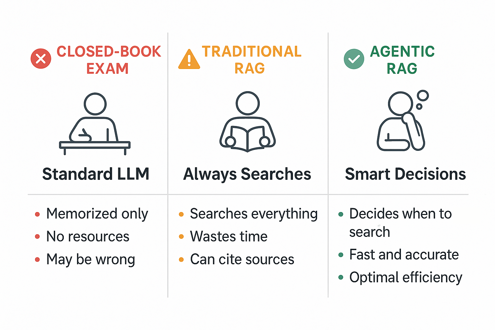
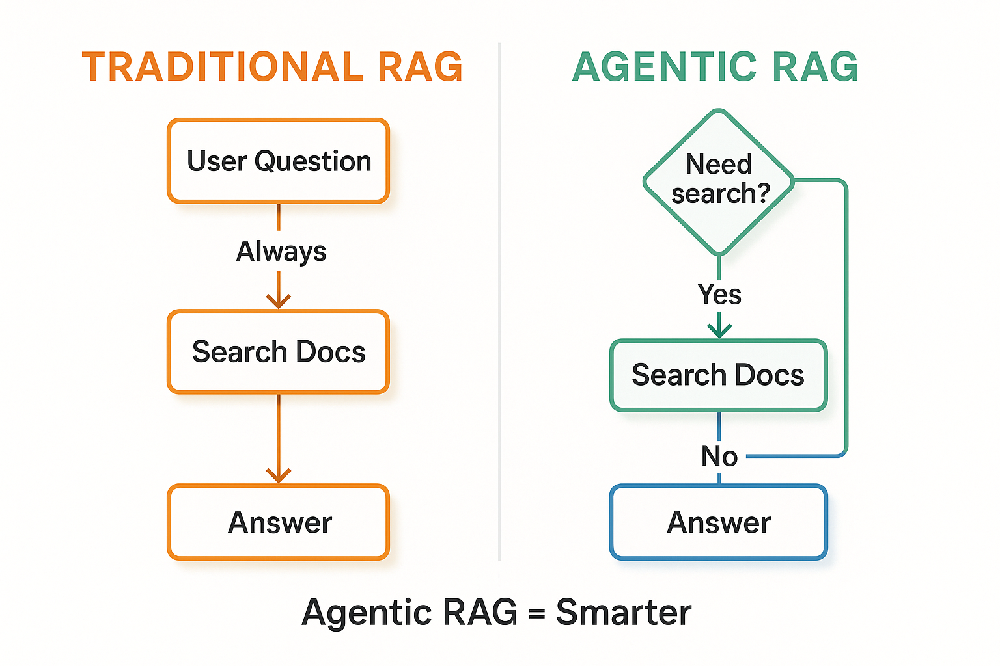
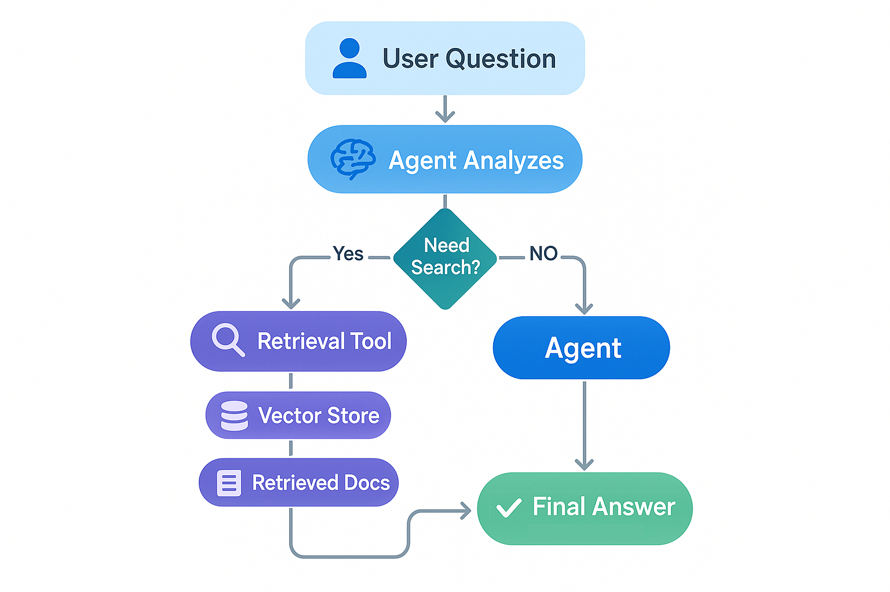
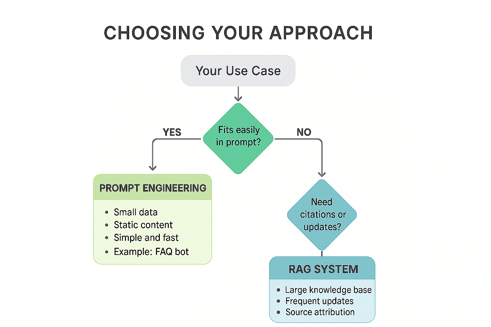

# Building Agentic RAG Systems

In this lab, you'll learn to build **Agentic RAG** systems where AI agents intelligently decide when and how to search your documents to answer questions. Unlike traditional RAG that always searches regardless of need, agentic RAG gives your AI the autonomy to determine whether retrieval is necessary—answering directly when it has the knowledge, or searching your documents when additional context is needed.

You'll combine everything you've learned to build intelligent question-answering systems that provide accurate, sourced answers from custom knowledge bases. You'll continue using:

- Tools from [Function Calling & Tools](../04-function-calling-tools/README.md)
- Agents from [Getting Started with Agents](../05-agents/README.md)
- Document retrieval from [Documents, Embeddings & Semantic Search](../07-documents-embeddings-semantic-search/README.md)

## Prerequisites

- Completed [Function Calling & Tools](../04-function-calling-tools/README.md)
- Completed [Getting Started with Agents](../05-agents/README.md)
- Completed [Documents, Embeddings & Semantic Search](../07-documents-embeddings-semantic-search/README.md)

##  Learning Objectives

By the end of this lab, you'll be able to:

-  Understand the difference between Agentic RAG and Traditional RAG
-  Build agents that decide when to search vs answer directly
-  Create retrieval tools from vector stores
-  Implement intelligent document search with agent decision-making
-  Handle context and citations in agentic systems
-  Apply the decision framework (RAG vs Prompt Engineering)

---

##  The Smart Student Analogy

**Imagine three types of students taking an exam:**

**Closed-Book Exam (Standard LLM)**:

-  Student relies only on memorized knowledge
-  Can't look up specific facts
-  May give wrong answers confidently
-  Knowledge cutoff (stops learning at training time)

**Open-Book Exam with No Strategy (Traditional RAG)**:

-  Student can reference textbook during exam
-  Looks up the textbook for EVERY question, even "What is 2+2?"
-  Wastes time searching when they already know the answer
-  More accurate, can cite sources
-  Slower and more expensive due to unnecessary searches

**Smart Open-Book Exam (Agentic RAG)**:

-  Student can reference textbook during exam
-  **Decides** when to look things up vs answering from knowledge
-  "What is 2+2?" → Answers directly (no search needed)
-  "What was our company's Q3 revenue?" → Searches documents
-  Fast for simple questions, thorough for complex ones
-  More accurate, can cite sources when needed

**This is the power of Agentic RAG!** The agent makes intelligent decisions about when retrieval is necessary.



*The Smart Student analogy: Closed-book relies only on memory, Traditional RAG searches everything, Agentic RAG intelligently decides when to search.*

---

##  Agentic RAG vs Traditional RAG

### The Key Difference

**Traditional RAG**:

```
User Question → ALWAYS Search → Retrieve Docs → Generate Answer
```

Every question triggers a search, even if the agent already knows the answer.

**Agentic RAG**:

```
User Question → Agent Decides → [Search if needed] → Generate Answer
```

The agent uses reasoning to determine whether retrieval is necessary.



*Traditional RAG always searches, while Agentic RAG makes intelligent decisions about when searching is necessary.*

### Example: The Difference in Action

**"What is 2 + 2?"**

- Traditional RAG: Searches vector store, retrieves irrelevant docs, answers "4" (wasted search)
- Agentic RAG: Answers immediately "4" (no search needed)

**"What was our company's revenue in Q3 2024?"**

- Traditional RAG: Searches vector store, retrieves financial docs, answers "$1.2M"
- Agentic RAG: Searches documents, answers "$1.2M based on Q3 financial report"

### Benefits of Agentic RAG

| Benefit | Traditional RAG | Agentic RAG |
|---------|-----------------|-------------|
| **Efficiency** | Searches every time | Only searches when needed |
| **Speed** | Slow for simple questions | Fast for simple, thorough for complex |
| **Cost** | Embedding + search cost on every query | Lower cost - searches only when necessary |
| **Intelligence** | Rigid, predictable | Adaptive, makes decisions |
| **Complexity** | Simple pipeline | Requires agent loop |

### When to Use Each Approach

**Use Traditional RAG when**:

- Every question requires searching your documents
- Example: "Search our legal database for cases about X"
- You want predictable, simple behavior

**Use Agentic RAG when**:

- Questions mix general knowledge and custom data
- Example: "What is the capital of France and what's our Paris office address?"
  - Agent answers capital from general knowledge (Paris)
  - Agent searches documents for office address
- You want optimal performance and cost

**For most applications, Agentic RAG is the better choice** because it combines flexibility with efficiency.

---

## ️ Agentic RAG Architecture



*Agentic RAG Architecture: The agent decides whether to retrieve documents or answer directly, then generates a response with citations when needed.*

**Key Components**:

1. **Agent**: Makes decisions about when to search
2. **Retrieval Tool**: Searches the vector store when needed
3. **Vector Store**: Contains your document embeddings
4. **Intelligent Decision**: Agent decides search vs direct answer

### When to Use RAG vs Prompt Engineering

**Decision tree:**

1. Fits easily in prompt? → **Prompt Engineering**
2. Large knowledge base that doesn't fit? → **RAG**
3. Updates frequently? → **RAG**
4. Need source citations? → **RAG**



*Decision tree for choosing between Prompt Engineering (small, static data) and RAG (large, dynamic knowledge base with citations).*

**Prompt Engineering**: Small data, static content (e.g., FAQ bot with 20 questions). Simple, fast, no infrastructure.

**RAG**: Large knowledge base, frequent updates, need citations (e.g., customer support with 10,000 manuals). Scalable, up-to-date, provides source attribution.

---

##  Building Your First RAG System

Before we build a RAG system, let's make sure RAG is the right choice! Let's see the decision framework in action.

### Example 1: Choosing the Right Approach (RAG vs Alternatives)

This example demonstrates the decision framework we just learned, comparing Prompt Engineering and RAG side by side to understand when each approach makes sense.

**Key code you'll work with:**

```python
# Wrap vector store in a retrieval tool for the agent
@tool
def search_docs(query: str) -> str:
    """Search company documentation for technical information..."""  # Agent reads this to decide when to call
    results = vector_store.similarity_search(query, k=2)  # Search for top 2 matches
    return "\n\n".join([f"[{doc.metadata['source']}]: {doc.page_content}" for doc in results])

# Create agent with the retrieval tool - agent decides when to use it
agent = create_agent(model, tools=[search_docs], system_prompt="...")
```

**Code**: [`code/01_when_to_use_rag.py`](./code/01_when_to_use_rag.py)  
**Run**: `python 08-agentic-rag-systems/code/01_when_to_use_rag.py`

This demo shows two real-world scenarios:

1. **Scenario 1: Small FAQ Bot** → Uses **Prompt Engineering** (5 Q&As fit in prompt)
2. **Scenario 2: Large Documentation Bot** → Uses **Agentic RAG** (1000s of docs, agent decides when to search)

---

**You've learned about agentic RAG, but what exactly does "traditional RAG" look like?** Before building intelligent systems, let's see the traditional pattern—a simple approach that searches documents for every single query, even "What is 2+2?". This helps you understand the inefficiency that agents solve.

### Example 1a: Traditional RAG (Always-Search Pattern)

Let's see traditional RAG that always searches, regardless of whether it's needed.

**Key code you'll work with:**

```python
# Traditional RAG: Always retrieves, then generates (no agent decision!)
def traditional_rag(question: str) -> str:
    # Step 1: ALWAYS retrieve documents (even if not needed!)
    retrieved_docs = vector_store.similarity_search(question, k=2)
    context = "\n".join([doc.page_content for doc in retrieved_docs])
    
    # Step 2: Generate answer with context
    messages = [
        SystemMessage(content="Answer based on the provided context."),
        HumanMessage(content=f"Context:\n{context}\n\nQuestion: {question}")
    ]
    return model.invoke(messages).content
```

**Code**: [`code/01a_traditional_rag.py`](./code/01a_traditional_rag.py)  
**Run**: `python 08-agentic-rag-systems/code/01a_traditional_rag.py`

**Traditional RAG Pattern**:

1. User asks a question (ANY question)
2. System ALWAYS searches the vector store
3. System passes retrieved documents + question to LLM
4. LLM generates answer based on retrieved context

**The Problem**:

```text
Question: "What is the capital of France?"
Traditional RAG:  Searching documents... (wastes time and API calls)
Agent: I can answer this directly - it's Paris! (no search needed)
```

This example demonstrates:

- Using a simple 2-step retrieve-then-generate pattern
- How the system searches even for general knowledge questions
- Comparing costs: traditional RAG vs agentic approach
- When traditional RAG makes sense (queries always need document search)

**Key Insight**: Traditional RAG is simple and predictable, but inefficient. It searches every time, even when answering "What is 2+2?". This wastes API calls, time, and money on unnecessary retrieval operations.

---

**Traditional RAG often wastes time searching for every question, even general knowledge ones.** How do you build a system that's smart enough to only search when needed—answering "What is 2+2?" directly but searching documents for "What was our Q3 revenue?" That's agentic RAG: wrap your vector store in a tool and let the agent decide when to use it.

### Example 2: Agentic RAG with Retrieval Tool

Let's see how to create a retrieval tool from a vector store using `@tool` and give it to `create_agent()` for intelligent decision-making.

**Key code you'll work with:**

```python
# Create a retrieval tool that the agent can choose to use
@tool
def search_langchain_docs(query: str) -> str:
    """Search LangChain documentation for specific information..."""  # Agent decides when to call based on this
    results = vector_store.similarity_search(query, k=2)  # Semantic search
    return "\n\n".join([f"[{doc.metadata['source']}]: {doc.page_content}" for doc in results])

# Agent autonomously decides: general knowledge? Answer directly. Need docs? Use tool.
agent = create_agent(model, tools=[search_langchain_docs], system_prompt="...")
```

**Code**: [`code/02_agentic_rag.py`](./code/02_agentic_rag.py)  
**Run**: `python 08-agentic-rag-systems/code/02_agentic_rag.py`

**Example code:**

> ** Note**: The code snippet below is simplified for clarity. The actual code file includes more documents, tests multiple questions that show when the agent searches vs answers directly, and provides detailed console output showing the agent's decision-making process.

```python
import os
from dotenv import load_dotenv
from langchain.agents import create_agent
from langchain_core.documents import Document
from langchain_core.messages import HumanMessage
from langchain_core.tools import tool
from langchain_core.vectorstores import InMemoryVectorStore
from langchain_openai import AzureOpenAIEmbeddings, ChatOpenAI

load_dotenv()


def get_embeddings_endpoint():
    """Get the Azure OpenAI endpoint, removing /openai/v1 suffix if present."""
    endpoint = os.getenv("AI_ENDPOINT", "")
    if endpoint.endswith("/openai/v1"):
        endpoint = endpoint.replace("/openai/v1", "")
    return endpoint


# Create embeddings
embeddings = AzureOpenAIEmbeddings(
    azure_endpoint=get_embeddings_endpoint(),
    api_key=os.getenv("AI_API_KEY"),
    model=os.getenv("AI_EMBEDDING_MODEL", "text-embedding-ada-002"),
    api_version="2024-02-01",
)

# Create sample documents
docs = [
    Document(page_content="Our Q3 2024 revenue was $1.2 million", metadata={"source": "financials.txt"}),
    Document(page_content="The API uses OAuth 2.0 authentication", metadata={"source": "api-docs.txt"}),
    Document(page_content="Company headquarters is in Seattle, WA", metadata={"source": "about.txt"}),
]

# Create vector store
vector_store = InMemoryVectorStore.from_documents(docs, embeddings)

# Create retrieval tool - agent decides when to use it!
@tool
def search_company_docs(query: str) -> str:
    """Search company documentation for specific information about 
    revenue, API details, company information, etc.
    Use this when you need to look up specific company data.
    """
    results = vector_store.similarity_search(query, k=2)
    return "\n\n".join([
        f"[{doc.metadata['source']}]: {doc.page_content}" 
        for doc in results
    ])

# Create agent with the retrieval tool
model = ChatOpenAI(
    model=os.getenv("AI_MODEL"),
    base_url=os.getenv("AI_ENDPOINT"),
    api_key=os.getenv("AI_API_KEY"),
)
agent = create_agent(
    model,
    tools=[search_company_docs],
    system_prompt="You are a helpful assistant with access to company documents. Use the search tool when you need specific company information. For general knowledge questions, answer directly.",
)

# Test: Agent decides when to search
queries = [
    "What is 2 + 2?",           # Agent answers directly (no search)
    "What was Q3 revenue?",     # Agent searches documents
    "What is the capital of France?",  # Agent answers directly
    "Where is the company headquarters?",  # Agent searches documents
]

for query in queries:
    print(f"\n Query: {query}")
    response = agent.invoke({"messages": [HumanMessage(content=query)]})
    print(f"Answer: {response['messages'][-1].content}")
```

### Expected Output

When you run this example with `python 08-agentic-rag-systems/code/02_agentic_rag.py`, you'll see:

```text
 Query: What is 2 + 2?
 Agent answered from knowledge
Answer: 4

 Query: What was Q3 revenue?
 Agent searched documents
Answer: According to our financial documents, Q3 2024 revenue was $1.2 million.

 Query: What is the capital of France?
 Agent answered from knowledge
Answer: The capital of France is Paris.

 Query: Where is the company headquarters?
 Agent searched documents
Answer: Company headquarters is in Seattle, WA.
```

---

##  When to Use RAG vs Prompt Engineering

| Criteria | Prompt Engineering | RAG |
|----------|-------------------|-----|
| **Data Size** | Small (fits in prompt) | Large (1000s of docs) |
| **Update Frequency** | Rarely changes | Frequently updates |
| **Need Citations** | No | Yes |
| **Example** | FAQ bot with 20 questions | Customer support with 10,000 manuals |

**Decision Tree**:
1. Fits easily in prompt? → **Prompt Engineering**
2. Large knowledge base that doesn't fit? → **RAG**
3. Updates frequently? → **RAG**
4. Need source citations? → **RAG**

---

##  Key Takeaways

- **Traditional RAG** always searches, even when unnecessary (simple 2-step: retrieve → generate)
- **Agentic RAG** lets the agent decide when to search
- Create **retrieval tools** from vector stores using `@tool`
- Use `create_agent()` from `langchain.agents` to build intelligent decision-making agents
- **Cite sources** when using retrieved information
- Choose **RAG vs Prompt Engineering** based on data size and update frequency

---

##  Dependencies

```bash
pip install langchain langchain-openai langchain-core langgraph python-dotenv
```
